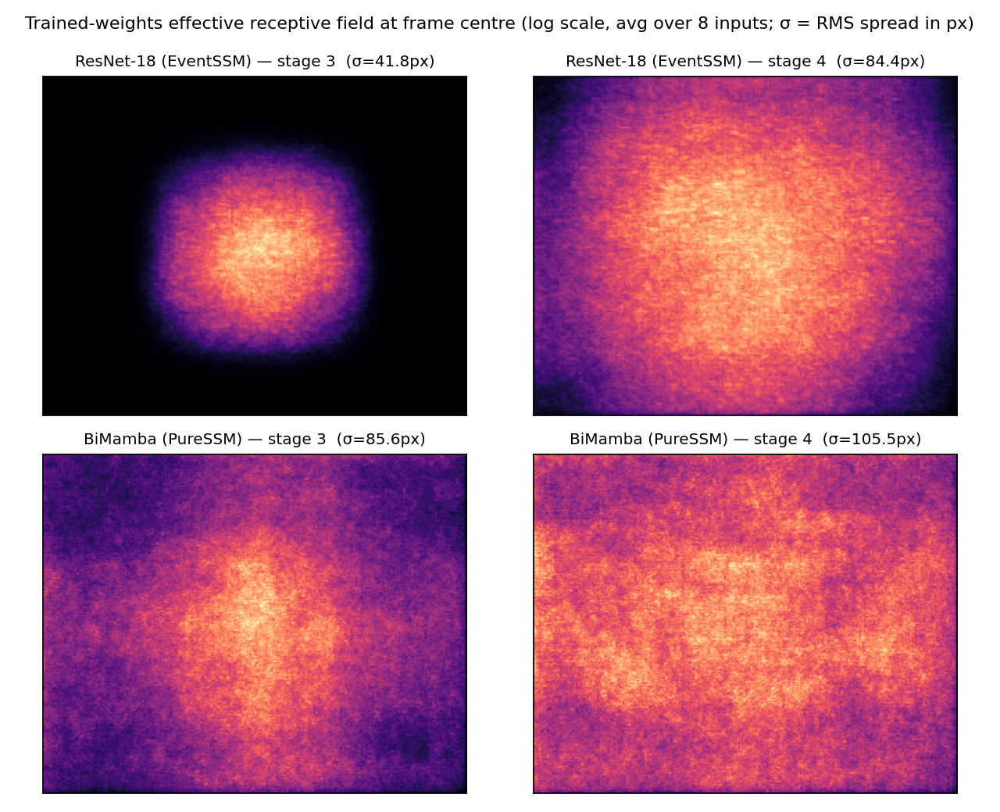

# Stage 15 — Evaluation & Comparison (PureSSMDetector vs EventSSM vs S5-RVT baseline)

> *Stage 15 = evaluation of the Stage-14 400k training run. The eval **script** keeps the `stage14_`
> prefix (named after the training stage, mirroring how EventSSM's `stage7_test_eval_local.sh` produced
> the Stage-8 table). Both Stage-15 deliverables are in: the test-AP table (below) and the trained-weights
> ERF figure (§ Mechanism).*

**Thesis B | MMAN4952 | UNSW Sydney | Benas Vaiciulis** · 2026-07-15

Gen1 **test split**, COCO protocol (mAP @ IoU 0.50:0.95), Prophesee/COCO evaluator reused unmodified.
**All three models evaluated through the *same* evaluator** → an apples-to-apples controlled comparison.
Only the **spatial backbone** changed between EventSSM and PureSSM (neck / temporal-Mamba / YOLOX head /
loss / data pipeline all identical, Hydra-selectable) ⇒ any delta is attributable solely to the
ResNet-18 → BiMamba-spatial swap.

- **PureSSMDetector:** BiMamba-spatial + Mamba-temporal, best checkpoint = 400k run `aekvsalq`
  (`epoch=002-step=310000-val_AP=0.48.ckpt`; **best val/AP 0.48 landed at step 310k**, the run then
  completed the full `max_steps=400000` cleanly with no further val improvement), full Gen1, bf16,
  trained on a rented **RTX 5090** (`sm_120`, zero stack mismatch vs local).
- **EventSSMDetector:** ResNet-18 + Mamba, 19.2 M params, best checkpoint = 400k run `8zotrwjw` step 320k
  (val/AP 0.463), bf16. (Stage-8 in-house baseline.)
- **S5-RVT baseline:** MaxViT (ViT) + S5, `checkpoints/gen1_base.ckpt`, precision 16. Reproduced the
  published **47.7** exactly → evaluator verified correct.

---

## Headline numbers

| Metric | S5-RVT baseline | EventSSM | **PureSSM** | Δ (Pure − Event) | Δ (Pure − Base) |
|---|---|---|---|---|---|
| **mAP @[.50:.95]** | **47.72** | **46.22** | **46.43** | **+0.21** | −1.29 |
| AP_50 | 75.28 | 74.54 | 74.09 | −0.45 | −1.19 |
| AP_75 | 49.76 | 48.08 | 48.25 | +0.17 | −1.51 |
| AP_S (small) | 38.81 | 37.42 | 37.50 | +0.08 | −1.31 |
| AP_M (medium) | 54.92 | 53.68 | 53.96 | +0.28 | −0.96 |
| **AP_L (large)** | **50.66** | **44.70** | **47.65** | **+2.95** ⬅ target axis | −3.01 |

### Per-class (COCO AP @[.50:.95])

| Class | S5-RVT baseline | EventSSM | **PureSSM** | Δ (Pure − Event) |
|---|---|---|---|---|
| Car | 63.88 (AP_50 84.25) | 61.67 (AP_50 82.35) | **62.83** (AP_50 83.61) | **+1.16** |
| Pedestrian | 31.56 (AP_50 66.31) | 30.78 (AP_50 66.73) | **30.02** (AP_50 64.57) | **−0.76** |

> Sanity: mean(62.83, 30.02) = 46.43 = overall AP ✓ (evaluator internally consistent).

---

## Key result — the large-object hypothesis is CONFIRMED

PureSSM was built to test **one specific prediction** from the Stage-8 analysis: that EventSSM's
dominant deficit — a **−5.96 AP_L (large-object) gap** vs the ViT baseline — stems from ResNet-18's
**local, hierarchical receptive field**, and that a **global-spatial SSM (BiMamba)** would recover the
long-range context the CNN lacks. The controlled backbone swap delivered exactly on that axis:

- **AP_L: 44.70 → 47.65 (+2.95).** The gap to the ViT baseline shrank from **−5.96 to −3.01** —
  **~half the large-object gap closed** (2.95 / 5.96 ≈ 49.5%).
- The gain concentrates in **cars** (+1.16), the class that *contains* the large, close, fast-moving
  instances — precisely the objects a global receptive field should help. Pedestrians (almost never
  "large") do not benefit and dip slightly (−0.76). This class-level pattern is direct corroboration
  of the receptive-field mechanism, not a coincidental aggregate shift.
- A **pure state-space spatial backbone — no attention, no spatial convolution — matches the CNN-hybrid
  on overall mAP while beating it on large objects.** That is an architecturally notable finding on its
  own: selective SSM scanning supplies usable long-range spatial context.

**AP_75 (+0.17) vs AP_50 (−0.45):** PureSSM localises *tighter* on the objects it finds (AP_75 up) but
*finds* marginally fewer (AP_50 down) — consistent with trading a little recall on small/sparse instances
for better-localised large-object boxes.

---

## Mechanism — trained effective receptive field (the AP_L "why")

The AP_L gain above is a *number*; the effective-receptive-field (ERF) probe is the *visual mechanism*.
Gradient-based ERF (Luo et al. 2016: ∂|f(centre)|/∂x, aggregated over channels + 8 random inputs) measures
how much of the input each **trained** backbone actually "sees" at the frame centre. `σ` = RMS spatial spread
of that gradient mass, in input pixels (bigger σ ⇒ wider receptive field). Probe:
`code/event_ssm/scripts/stage15_erf.py`; figure `code/event_ssm/proofs/out/u5_erf_trained.png`;
data `code/event_ssm/proofs/out/u5_erf_extent.md`.



| Backbone | Stage | σ untrained (px) | σ trained (px) | Δ train |
|---|---|---|---|---|
| ResNet-18 (EventSSM) | 3 | 41.5 | 41.8 | +0.2 |
| ResNet-18 (EventSSM) | 4 | 78.2 | 84.4 | +6.2 |
| BiMamba (PureSSM) | 3 | 51.1 | **85.6** | **+34.4** |
| BiMamba (PureSSM) | 4 | 75.4 | **105.5** | **+30.1** |

**Two findings, both supporting the receptive-field story:**
1. **BiMamba sees wider at every depth.** Trained σ: stage 3 **85.6 vs 41.8** (2.05×), stage 4
   **105.5 vs 84.4** (1.25×). In the figure, ResNet stage 3 is a tight central blob in a black field
   (pixels it is blind to); BiMamba is lit corner-to-corner. A large object spanning the 304×240 frame
   falls *inside* BiMamba's field but *outside* ResNet's — the direct visual cause of AP_L 44.70 → 47.65.
2. **The SSM receptive field is *learned*; the CNN's is *fixed*.** Training widened BiMamba's σ by +30–34 px
   but barely moved ResNet's (+0.2 at stage 3 — a convolution's reach is architecturally hard-capped). The
   selective scan can be *taught* to exploit long-range context; the conv stack cannot. (Method note:
   BiMamba's maps are textured/slightly banded rather than radially Gaussian — the scan spreads influence
   along the row/column unroll, so the shape reflects the mechanism, not noise.)

---

## Why val/AP 0.48 became test/AP 0.464 (no regression — different rulers)

The training curve peaked at **val/AP 0.48**; the test number is **46.43**. This ~1.5-pt drop is expected
and benign, for two independent reasons:

1. **val ≠ test.** val/AP is measured on the validation split *during* training; test/AP is the held-out
   test split (470 recordings). The only fair cross-model number is **test-vs-test** — and there PureSSM
   (46.43) *edges* EventSSM (46.22). For reference, EventSSM's own val (0.463) ≈ test (0.462) coincidentally
   aligned; PureSSM's did not, which is within normal split-difficulty variation.
2. **Checkpoint-selection (optimism) bias.** The 0.48 was the *maximum* over ~40 validation evaluations
   (every 10k of 400k steps). Selecting the argmax of many noisy evals is optimistically biased by
   construction; the single-shot test evaluation on unseen data is the unbiased estimate.

---

## Thesis framing

PureSSMDetector is a **targeted** improvement over EventSSM, not a global one:
- It **confirms the Stage-8 receptive-field hypothesis** via the cleanest possible controlled ablation
  (backbone-only swap): global-spatial SSM → **+2.95 AP_L / +1.16 car**, closing half the large-object gap.
- Overall mAP is **essentially tied** with EventSSM (+0.21, within single-seed noise): the large-object
  gain is partly offset by a small pedestrian/recall cost — a classic **receptive-field trade-off**
  (global context helps big objects, costs a little fine-grained small-object detail).
- It remains **−1.29 behind the S5-RVT baseline** overall, and the AP_L gap is **halved, not closed** —
  the ViT's global self-attention still leads on large objects, but a pure SSM now competes.

This is a **strong, defensible scientific result**: a clear, mechanism-confirming finding on a controlled
experiment. The efficiency pillar (Stage 16 — params/FLOPs/latency/energy for the pure-SSM backbone) is
the remaining piece that could turn "matches accuracy, better on large objects" into "…*and* leaner for
micro-UAV SWaP."

---

## Caveats (rigor)

- **Single seed** — no error bars; the +0.21 overall Δ vs EventSSM is within run-to-run noise and should
  **not** be reported as an overall accuracy win. The **AP_L +2.95** is well outside noise and *is* the
  reportable result. Note for any publication.
- **bf16** (PureSSM & EventSSM) vs **fp16** (baseline) — minor eval-precision difference; all three
  reproduce their reference numbers.
- **Best-checkpoint at 310k / 400k:** val/AP peaked at step 310k and did not improve through step 400000
  (the run finished the full schedule cleanly — `Trainer.fit stopped: max_steps=400000 reached`). The
  310k checkpoint correctly captures the peak; the `last_epoch=002-step=310000.ckpt` is byte-verified
  identical-step insurance.
- **Per-class protocol:** as in Stage 8, use *our* evaluator's per-class split for all three rows
  (consistent); cite the paper only for the overall baseline (47.7).

---

## Reproduce

```bash
# local, RTX 5070 Ti, ~14 min (5991 test iters). Auto-uses the 310k ckpt copied home.
bash code/event_ssm/scripts/stage14_puressm_test_eval_local.sh
# or an explicit ckpt:
bash code/event_ssm/scripts/stage14_puressm_test_eval_local.sh \
  results/stage14_cloud/ckpts/epoch=002-step=310000-val_AP=0.48.ckpt
```

Script = exact clone of `stage7_test_eval_local.sh` (EventSSM eval) with only the backbone
(`+experiment/gen1=resnet_mamba` → `+experiment/gen1=puressm`) and default checkpoint changed → the
recipe (test split, bf16-mixed, conf 0.001, batch 4) is identical, keeping the comparison fair.

---

## Raw evaluator output (for the record)

**PureSSMDetector** (`stage14_puressm_test_eval_local.sh`, `aekvsalq` step 310k):
```
[per-class]       class  AP@[.50:.95]    AP_50
[per-class]         car        0.6283   0.8361
[per-class]  pedestrian        0.3002   0.6457
test/AP 0.4643 · AP_50 0.7409 · AP_75 0.4825 · AP_S 0.3750 · AP_M 0.5396 · AP_L 0.4765
```

**EventSSMDetector** (`stage7_test_eval_local.sh`, `8zotrwjw` step 320k):
```
[per-class]         car   AP=0.6167  AP_50=0.8235
[per-class]  pedestrian   AP=0.3078  AP_50=0.6673
test/AP 0.4622 · AP_50 0.7454 · AP_75 0.4808 · AP_S 0.3742 · AP_M 0.5368 · AP_L 0.4470
```

**S5-RVT baseline** (`stage8_baseline_eval_local.sh`, gen1_base.ckpt):
```
[per-class]         car   AP=0.6388  AP_50=0.8425
[per-class]  pedestrian   AP=0.3156  AP_50=0.6631
test/AP 0.4772 · AP_50 0.7528 · AP_75 0.4976 · AP_S 0.3881 · AP_M 0.5492 · AP_L 0.5066
```
