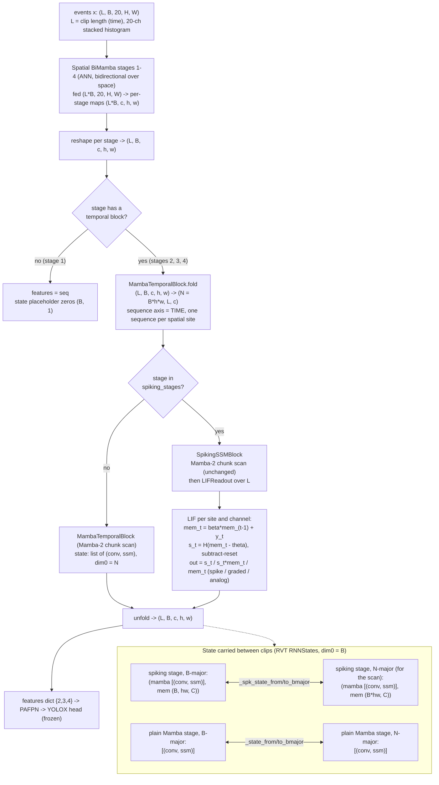

# Stage 18 — SpikingSSM Backbone Integration: Notes and Decision Record

**Thesis C · MMAN4953 · UNSW Sydney · Benas Vaiciulis** · 2026-10-06 · **Branch:** `stage18-spikingssm` (base `287b996`)
**Spec:** `docs/specs/2026-10-06-stage18-spikingssm-integration-design.md` · **Plan:** `docs/plans/2026-10-06-stage18-spikingssm-integration.md`
**Predecessor:** `docs/notes/Stage17_build_notes.md` (spiking cell) · **Master plan:** `docs/plans/2026-09-07-thesis-c-plan.md`

This document is the complete reasoning record for Stage 18. It is written so that the thesis chapters can be drafted from it
without recourse to the (deleted) subagent workspace: every problem encountered, every decision taken, who took it, the
measured evidence behind it and where it belongs in the dissertation are recorded in §4. Numbers and commit SHAs are
quoted verbatim from the build and review logs.

---

## 1. What was built

Stage 18 makes the Stage-17 spiking temporal block selectable as a drop-in recurrent backbone for the frozen RVT pipeline
(PAFPN neck, YOLOX head, losses, Gen1 data, Prophesee evaluator, 400k-step recipe), exactly as PureSSM was integrated in Stage 12.

| Component | Location | Role |
|---|---|---|
| `SpikingSSMBackbone` | `code/event_ssm/models/spikingssm/backbone.py` | Subclass of the **unmodified** `ResNetMambaBackbone`. Swaps the temporal block on `spiking_stages` for `SpikingSSMBlock` (Mamba-2 + LIF readout) and overrides `forward` so every stage carries the correct state type. |
| `_spk_state_to_bmajor` / `_spk_state_from_bmajor` | same file | Spiking-aware state reshape helpers for the `(mamba_state, mem)` tuple (RVT stores dim0 = B; the scan needs dim0 = N = B·h·w). |
| `spiking_stats()` | same file | Per spiking stage: last firing rate, learned `beta` (mean/min/max) and `threshold` mean. Host sync — called at monitor cadence only. |
| Registry dispatch | `code/event_ssm/integration/register.py` | Additive `"SpikingSSM"` branch in `build_recurrent_backbone`; config modifier widened to the third name. Existing branches byte-identical. |
| `attach_spiking_monitor` | `code/event_ssm/integration/monitors.py` | Firing-rate watch: prints `[spk-monitor]` line each `every_n` forwards, warns on SILENT (< 0.01) and SATURATED (> 0.90), logs to W&B when a run is active. Default off. |
| Model config | `code/event_ssm/configs/spikingssm_yolox/default.yaml` | PureSSM model config + a `backbone.spiking` block. |
| Experiment config | `code/event_ssm/configs/experiment/gen1/spikingssm.yaml` | Recipe byte-identical to `puressm.yaml` (only the model group differs). |
| Symlink recipe | `docs/patches/README.md` ("Stage 18" section) | Re-creates the two Hydra symlinks into the gitignored `external/` RVT tree after a re-clone. |
| Tests | `code/event_ssm/tests/models/spikingssm/` | 18 new non-GPU tests, 13 GPU tests in `test_backbone_gpu.py` (see §6). |

**Selection (train, test-eval and the Stage-10 benchmark use the same launchers as every other model):**

```bash
model=rnndet +experiment/gen1=spikingssm
```

**Stage-17 corrections made inside this stage** (D6 and D7 in §4): the `LIFReadout` constructor now rejects `beta` at the
epsilon boundary (it previously passed validation and then crashed with `math.log(0)`), and the per-forward host sync on the
firing rate was removed. Both are in commit `32ccb7e`; all 31 Stage-17 CPU tests passed unmodified.

### 1.1 Data and state flow (one backbone forward)



Two properties of the state contract are load-bearing. First, `mem` is deliberately shaped `(N, C)` with dim0 = N, so the same
`(N, ...) <-> (B, hw, ...)` reshape that the parent applies to the Mamba state applies to the membrane; RVT's
`RNNStates.recursive_detach` / `recursive_reset` recurse through nested lists and tuples, so **no RVT change is required** and zeroing
`mem` on a sequence reset is the correct LIF reset. Second, the choice between the plain and the spiking helper is made **per stage**,
which is what makes the mixed ladder `spiking_stages=[4]` (plain stages 2–3, spiking stage 4 in one forward) a distinct code path
that required its own tests (D11).

---

## 2. Ablation-arm cheat-sheet (every arm is a CLI override)

All overrides are appended to `model=rnndet +experiment/gen1=spikingssm`. The recipe, neck, head, losses and data are frozen; only the
model group differs from PureSSM.

| Purpose | Override | Note |
|---|---|---|
| Output-mode decomposition (headline) | `model.backbone.spiking.output_mode={spike,graded,analog}` | `analog` keeps leak and subtract-reset (D9); it is **not** a PureSSM copy. |
| De-risking ladder | `model.backbone.spiking.spiking_stages=[4]` then `[3,4]` then `[2,3,4]` | Must be a subset of `in_stages` (validated before anything is built). `[2,3,4]` is the default. |
| Integration null test (no flag needed in training) | `spiking_stages=[]` | Numerically the PureSSM backbone; proven by `test_no_spiking_stages_equals_puressm`. |
| Energy–accuracy Pareto | `model.backbone.spiking.threshold=<value>` | Higher threshold gives sparser firing, fewer SOPs, lower energy. Do not report a single operating point. |
| Analog bypass (escape hatch) | `model.backbone.spiking.residual=True` | **Must be reported if used**: it weakens the spiking claim. |
| Other LIF knobs | `...spiking.{beta,alpha,learn_beta,learn_threshold,reset,detach_reset}` | Forwarded verbatim to `LIFReadout` through `_LIF_KEYS` in `register.py`. |
| Silence/saturation watch | `SPIKING_MONITOR=1 SPIKING_MONITOR_EVERY=200` | Env vars, default off, zero overhead when unset. Composes with `PURESSM_MONITOR=1` (spatial norms). |
| Local 16 GB card | `model.backbone.checkpoint_blocks=True` | As for PureSSM, whose Stage-11 probe measured 8.55 GB for checkpointed training and whose Stage-12 smoke used this override. The LIF time loop adds activations on the spiking stages: **re-measure peak VRAM at Stage 19** rather than assuming PureSSM's figure carries over. |

---

## 3. Verification at a glance

| Check | Result |
|---|---|
| Full default suite, `pytest code/event_ssm/tests/ -q` (repo root) | **161 passed, 25 deselected (gpu-marked), 27 warnings in 72.05 s** — 0 failures. Baseline before Stage 18 was 143 non-GPU tests; 161 − 143 = **18 new non-GPU tests** (lif +5, `test_backbone_cpu` 3, `test_register_spikingssm` 6, `test_spiking_monitor` 4). |
| Spiking GPU session, `pytest code/event_ssm/tests/models/spikingssm/ -m gpu -q` (RTX 5070 Ti idle at the guard: 2–8 % utilisation, 1.3–1.5 GiB resident, no compute processes listed by `nvidia-smi`) | **22 passed, 49 deselected in 33.42 s** = 9 Stage-17 gpu tests + 13 in `test_backbone_gpu.py` (the 7 tests planned for Task 2 became 13 through parametrisation over output mode and over the ladder, plus the D11 hardening). A second, independent run reproduced **22 passed in 34.58 s**. |
| Spiking package, all tests | 71 collected = 49 non-GPU + 22 GPU. |
| Frozen packages, `git diff --stat main -- code/event_ssm/models/eventssm code/event_ssm/models/puressm code/event_ssm/temporal code/event_ssm/backbone` | **Empty (exit 0)** — nothing in the frozen model/temporal/backbone code is modified. |
| Files changed vs `main` under `code/event_ssm/` | Only: `models/spikingssm/{__init__,backbone,lif}.py`, `integration/{register,monitors}.py` (additive), two new config files, and tests under `tests/models/spikingssm/`. Plus `docs/patches/README.md` (symlink recipe). |
| Task-1 deferred item "GPU parity test tolerance tightened 1e-3 to 1e-5, unverified on GPU" | **Verified**: `test_ssm_path_matches_the_non_spiking_block` passes at 1e-5 (both GPU runs). No relaxation needed. |

Model-config and recipe parity with PureSSM is enforced by tests, not by convention: `test_recipe_identical_to_puressm` (the experiment
yaml equals `puressm.yaml` once the `defaults` list is removed) and `test_model_config_identical_to_puressm_except_spiking` (the model
yaml equals `puressm_yolox/default.yaml` once `name` and the `spiking` block are removed). This is what licenses the statement that
any mAP delta against PureSSM is attributable to the spiking readout.

---

## 4. Problems found and decisions

Format for every item: symptom or question, evidence, root cause or options considered, decision and who made it
("user" = explicit decision by the thesis author; "plan" = fixed by the agreed Stage-18 plan), consequence, and where it is used in the thesis.

### D1. Schedule position when Stage 18 started

- **Question.** Where does Stage 18 sit relative to the Thesis-C timeline, and how much slack is left?
- **Evidence.** 2026-10-06 is Week 4 of the timeline, the **kill-switch week** (decision due Sunday 11 October). The timeline had
  budgeted Stage 18 for Week 1, Stage 19 (smoke) for Week 2 and Stage 20a for Week 3. Nothing spiking was trainable on 6 October.
- **Decision (user, with the plan).** Stage 18 now, as roughly one day of CPU-side development; then Stage 19 smoke **locally** on the
  5070 Ti (PureSSM's checkpointed training peaks at ≈ 8.6 GB in the Stage-11 probe, which fits the 16 GB card, so no cloud rental is
  planned; to be re-confirmed with the LIF activations at Stage 19); then the 25k short run
  locally; then an honest kill-switch call on measured stability rather than on intent.
- **Consequence.** The kill-switch criterion ("is the spiking model training stably?") will be evaluated on the Stage-19/short-run
  evidence, not on this integration alone. The schedule slip is itself a reportable risk-register entry.
- **Thesis use.** Ch.7 and the timeline/risk appendices (how the kill-switch was applied; schedule slip against plan).

### D2. Design: subclass, do not edit

- **Question.** How is a spiking backbone added without perturbing the controlled comparison?
- **Decision (plan).** `SpikingSSMBackbone` subclasses the unmodified `ResNetMambaBackbone`. The skeleton is PureSSM (BiMamba spatial
  stages stay ANN: choice C). Only the temporal readout on `spiking_stages` changes, so any mAP difference against PureSSM is
  attributable to the spiking readout alone. `spiking_stages ⊆ temporal_stages` exposes the de-risking ladder
  (`[4]` → `[3,4]` → `[2,3,4]`) as a single config value; a violating configuration raises `ValueError` before anything is built,
  because a spiking stage with no temporal block would be silently ignored and would mislabel an ablation arm.
- **Consequence.** The three frozen packages show an empty `git diff` against `main` (§3).
- **Thesis use.** Ch.3 Methodology (architecture of the spiking model; the controlled-ablation argument).

### D3. Dispatch through an additive branch in `register.py`

- **Options.** (a) An additive `"SpikingSSM"` branch in the shared harness entry point (the Stage-12 precedent for PureSSM).
  (b) Zero-edit chaining through a new `spikingssm/register.py` with duplicated train/eval launchers.
- **Decision (user): (a).** Every existing launcher (training, test evaluation, the Stage-10 benchmark) then works unchanged with
  `+experiment/gen1=spikingssm`; option (b) would have duplicated the launchers and invited recipe drift between models.
- **Consequence.** This is the only touch to pre-existing harness code; the existing branches are byte-identical.
- **Thesis use.** Ch.4 Experimental Setup (one harness, four models; why recipe drift is excluded by construction).

### D4. Plan-mandated duplication governs

- **Question.** `SpikingSSMBackbone.forward` repeats the parent's forward loop (≈ 20 lines; only the per-stage state-helper choice
  differs), and the register branch repeats PureSSM's BiMamba construction (≈ 7 lines). Should this be refactored away?
- **Decision (user, pre-flight ruling): no.** Refactoring for DRY would require editing the frozen files and would break the
  "byte-identical" guarantee on which the ablation's credibility rests. The reviewer verified there is no drift
  (`backbone.py:128-153` against `resnet_mamba.py:63-84`) and the null test (D2, `spiking_stages=[]`) guards the all-ANN path
  numerically. Reviewer duplication findings for Tasks 2 and 3 were parked under this ruling.
- **Consequence.** A deliberate, documented duplication; revisit only if the parent forward is ever changed (the null test will fail
  loudly if the two diverge).
- **Thesis use.** Ch.3 (engineering rationale) and the reproducibility appendix (the byte-identical-frozen-code policy).

### D5. Process: branch in place, not a git worktree

- **Decision (plan).** `external/` (RVT) is gitignored and the tests resolve it relative to the repository, so a worktree would not
  contain it. Work was done on branch `stage18-spikingssm` in the main checkout.
- **Thesis use.** Reproducibility appendix (environment/tooling note only).

### D6. Latent Stage-17 bug: `beta == eps` crashed `LIFReadout` construction

- **Symptom.** `LIFReadout(4, beta=1e-4)` raised `ValueError: math domain error`. Found while writing the Stage-18 plan.
- **Root cause.** The constructor validated only `0 < beta < 1`. The epsilon-squeezed sigmoid `beta = eps + (1−2·eps)·sigmoid(logit)`
  (Stage-17 fix for float32 saturation) needs `eps < beta < 1−eps` to be invertible; at `beta = eps = 1e-4` the inverse yields
  `p = 0` and `log(0)`.
- **Impact.** The pending Stage-17 GPU test `test_ssm_path_matches_the_non_spiking_block` used exactly `beta = 1e-4`. It would have
  crashed in the constructor before asserting anything. Because the GPU tests had never run (pending an idle card), the defect had
  gone unseen.
- **Fix (commit `32ccb7e`).** The constructor asserts the open interval with an explanatory message. The test was rewritten: it now
  compares `block(x)` against `lif(weight-identical MambaTemporalBlock(x))`, an **exact identity** checked at tolerance 1e-5
  (previously the approximate argument "beta → 0 reduces to plain Mamba" at 1e-3). New tests: `beta ∈ {1e-4, 1−1e-4, 1e-5}` rejected
  cleanly; `beta = 2e-4` (just inside) initialises exactly.
- **Evidence the fix holds.** The tightened 1e-5 test passes on the GPU in this stage's verification (both runs).
- **Thesis use.** Reproducibility/testing appendix: an example of a numerical edge case discovered only when a deferred hardware test was
  scrutinised, and of replacing an approximate equivalence with an exact one.

### D7. Stage-17 performance defect: per-forward GPU-to-host sync on the firing rate

- **Symptom.** `LIFReadout.forward` ended with `float(spike_sum / L)`, forcing a device synchronisation once per spiking stage per
  step.
- **Impact.** It would have biased the Stage-22 latency and energy numbers (and slowed training marginally), contaminating exactly the
  quantity the efficiency pillar reports.
- **Fix (commit `32ccb7e`).** A detached 0-d tensor is stored; the `last_firing_rate` property converts to `float` only when read,
  i.e. at monitor cadence. Outputs are unchanged and all 31 Stage-17 CPU tests passed untouched.
- **Residual.** The lazy-tensor test checks that a tensor is stored, which is a proxy for the absence of a sync (deferred minor, §5).
  Reading `last_firing_rate` inside a CUDA-graph capture is unsupported (it syncs); relevant only if the Stage-22 deployment column
  uses graph replay for the spiking model.
- **Thesis use.** Ch.4 Experimental Setup (benchmark hygiene, alongside the Stage-10 contamination guards and idle-GPU fail-closed guard).

### D8. Streaming-parity criterion for a spiking model

- **Symptom.** In the first Task-2 GPU run, `test_streaming_two_clips_equals_one_clip[analog]` and `[graded]` failed with
  max|diff| = 1.0–1.8, against a planned max-absolute tolerance of 1e-3. The `spike` case passed its fraction criterion.
- **Evidence.** Only 1e-5 to 1.6e-4 of the elements deviated by more than 1e-3; the non-flipped elements agreed to ≈ 3e-4. Stage-4
  outliers were already present in **clip A (the first two frames, with no carried state)**, so the deviation is not a state-carry
  bug.
- **Root cause.** The Mamba-2 chunk scan is numerically length-dependent (≈ 1e-4 between L = 2 and L = 4). A membrane that sits
  within that noise of the threshold fires in one run and not in the other; with subtract-reset the membrane then differs by
  `threshold` (1.0) for every later step. That is an O(1) jump on isolated elements in **every** output mode (analog included, which
  still resets: see D9).
- **Options.** (1) A fraction criterion only. (2) A fraction criterion for all modes plus one strict max-absolute case with spiking
  disabled (`threshold = 1e6`, asserting zero firing). (3) Keep 1e-3 and investigate further.
- **Decision (user, 2026-10-06): option 2.** The strict case keeps a tight check of the Mamba-state and membrane carry that cannot hide
  behind the fraction allowance. Implemented in commit `986b64e`.
- **Measured result** (table in §4.1): worst fraction |diff| > 1e-3 is at most 1.6e-4 against a bound of 1e-3; the strict no-spike
  case reports firing rate exactly 0.0 and max|split − full| of 3.1e-4 / 4.2e-4 / 8.7e-4 against scale-relative allowances of
  5.0e-3 / 4.4e-3 / 4.3e-3 (stages 2/3/4).
- **Consequence and broader point.** A thresholded model amplifies floating-point noise into discrete flips, so **bit-level equality
  between streaming and batched (or differently chunked) evaluation is not achievable; parity must be statistical.** This applies to the
  Stage-21 evaluation reproducibility and to any streaming-versus-offline comparison of the spiking model.
- **Thesis use.** Ch.3/4 (verification of the recurrent-state contract) and Ch.6 Discussion (threshold sensitivity and numerical
  reproducibility of SNNs).

### D9. What the `analog` arm actually is (pre-registration revised)

- **Observation.** In `LIFReadout`, analog mode outputs the pre-reset membrane but **still applies leak (`beta`) and subtract-reset to
  the carried state**. It is not a copy of PureSSM's temporal output.
- **Consequence for the pre-registration.** The earlier claim "`analog` ≈ 46.4 (PureSSM), otherwise the integration is broken" is not a
  valid diagnostic: a gap could come entirely from the LIF dynamics, not from a wiring error.
- **Options.** (1) Keep the code and reframe the pre-registration. (2) Make analog skip the reset (a pure leaky integrator), closer to
  PureSSM; but then analog and graded would use different membrane dynamics and analog → graded would no longer isolate sparsity.
  (3) Defer to Stage 19.
- **Decision (user, 2026-10-06): option 1; the code is unchanged.**
  - **Integration check** = the `spiking_stages=[]` null test, proven numerically identical to PureSSM
    (`test_no_spiking_stages_equals_puressm`, `atol = 1e-6` on all four feature maps).
  - **Results ladder, all arms sharing one membrane:** PureSSM → `analog` (cost of the LIF dynamics: leak plus reset) → `graded`
    (cost of sparsity) → `spike` (cost of binarisation). The expected ordering `analog ≥ graded > spike` stands, and all three gaps are
    reported whatever their size.
- **Where the reframing was applied:** `CLAUDE.md` pre-registration bullet (a) and (c); `thesis/latex/main.tex` `\tbd` in
  `sec:spiking_results`; dated inline notes in `docs/plans/2026-09-07-thesis-c-plan.md` and `docs/notes/Stage17_build_notes.md`.
- **Known stale wording that could not be edited under this stage's constraints** (code and frozen documents; see §5):
  `lif.py` module docstring ("`analog` … the control arm … no spiking"), the `# analog = control arm, should ≈ PureSSM 46.4` comment in
  `configs/spikingssm_yolox/default.yaml:26`, and the spec/plan quotations of that comment. The comment is wrong in the sense of D9;
  the behaviour is as described here.
- **Thesis use.** Ch.3 Methodology (readout modes; what each arm holds fixed), Ch.5 §5.7 results structure (a four-rung ladder with
  three gaps) and Ch.6 Discussion (what "the cost of spiking" decomposes into).

### D10. Open items found in the repository review (not Stage-18 scope, not fixed here)

- `thesis/latex/main.tex` has duplicate labels `app:maths` (l.956–957) and `app:risk` (l.1041, 1045), producing LaTeX warnings.
- The risk table uses `[h!]` instead of `[htbp]` (project float rule) and carries a stale comment near l.1038.
- `thesis/supervisor_report/` is untracked and contains LaTeX build artefacts; it must not be committed.
- **Disposition.** Recorded only; the dissertation tidy-up is a separate task. This stage changed exactly one sentence in `main.tex`
  (D9) and introduced no new label or float.
- **Thesis use.** None (housekeeping).

### D11. Pre-merge test hardening: NaN-blind parity and the untested mixed ladder

- **Question (review follow-up).** Are the fraction-based parity tests, introduced by D8, strong enough?
- **Gap (a): NaN blindness.** `NaN.abs() > 1e-3` evaluates to `False`, so a NaN in the carried graded or spike state would count as
  "not deviating" and the test would pass.
- **Gap (b): the first rung of the ladder was untested.** `spiking_stages=[4]` (plain Mamba stages 2–3 and a spiking stage 4 in one
  forward) was covered only for block placement, never for a forward, streaming or reset pass, even though it is the intended Stage-19
  starting configuration and the only path that exercises the per-stage choice between plain and spiking state helpers.
- **Decision (user, 2026-10-06): fix both before merge.** Implemented in commit `5f27290`: an `isfinite` guard precedes the fraction check;
  the streaming, strict and RVT-reset tests are parametrised over `spiking_stages ∈ {[2,3,4], [4]}`; the strict test now also asserts zero
  firing after the first clip. The reset test confirms that stage 2 keeps the plain Mamba state and stage 4 the `(mamba, mem)` state, both
  zeroed for the reset sequence, and that the backbone resumes from the reset state.
- **Measured (mixed ladder `[4]`)** in the table of §4.1.
- **Result.** GPU session 13/13 in `test_backbone_gpu.py` at that commit; 22/22 for the whole spiking GPU set at the head of the branch.
- **Thesis use.** Reproducibility/testing appendix (verification coverage of the ablation configurations; why a parity test must guard
  against NaN).

### 4.1 Measured streaming-parity numbers (D8 and D11)

Setup: backbone with spatial depths (1,1,1,1), 64×96 frame, L = 4 split as 2 + 2, eval mode, seed 0/1. Columns are stages 2 / 3 / 4.
These numbers were logged during the build (`986b64e`, `5f27290`) and **re-measured on 2026-10-06 in the Task-5 verification session**;
the two sets agree to the digits shown (the only difference is 5.4e-4 / 9.8e-4 against the logged 5.5e-4 / 9.9e-4 in two strict cells,
i.e. last-digit run-to-run scan noise).

**Fraction of elements with |split − full| > 1e-3** (pass criterion: < 1e-3 per stage; also all outputs finite):

| Ladder | `analog` | `graded` | `spike` |
|---|---|---|---|
| `[2,3,4]` (all spiking) | 0 / 0 / 1.2e-4 | 1.0e-5 / 0 / 1.6e-4 | 1.0e-5 / 0 / 1.6e-4 |
| `[4]` (mixed ANN + spiking) | 0 / 0 / 8.1e-5 | 0 / 0 / 4.1e-5 | 0 / 0 / 4.1e-5 |

**Strict no-spike case** (`threshold = 1e6`, `analog` mode; firing rate asserted exactly 0.0 after the full pass and after each clip;
pass criterion: max|split − full| ≤ 1e-3 · max(1, max|full|)):

| Ladder | max|split − full| (stages 2 / 3 / 4) | Allowance (stages 2 / 3 / 4) | Margin (worst stage) |
|---|---|---|---|
| `[2,3,4]` | 3.1e-4 / 4.2e-4 / 8.7e-4 | 5.0e-3 / 4.4e-3 / 4.3e-3 | ≈ 5× |
| `[4]` | 1.8e-4 / 5.4e-4 / 9.8e-4 | 2.6e-3 / 2.2e-3 / 4.0e-3 | ≈ 4× |

Reading: the fraction criterion has ≥ 6× headroom (worst 1.6e-4 against 1e-3), and the strict case, which has no flips to hide behind,
passes with ≥ 4× headroom on the Mamba-state and membrane carry. The residual deviation is the chunk-scan length noise identified in D8.

---

## 5. Known limitations and deferred items

Source: the subagent-driven-development ledger. "Fixed" entries are closed in this branch; "Open" entries were not addressed by a
fix commit and remain **"see final review"** (the whole-branch review had not reported when this note was written, and the Task-4
review was still in progress; any Task-4 findings are therefore not listed here).

| Origin | Item | Status |
|---|---|---|
| Task 1 | Lazy-rate test checks that a tensor is stored, not the absence of a sync (a proxy) | Open — see final review |
| Task 1 | GPU parity test tolerance tightened 1e-3 → 1e-5, unverified on GPU | **Verified** in the Task-5 GPU session (passes; no relaxation needed) |
| Task 1 | `last_firing_rate` docstring could state that reading it inside CUDA-graph capture is unsupported | Open — see final review |
| Task 2 | Duplicated forward loop (`backbone.py:128-153` vs `resnet_mamba.py:63-84`) | **Parked** by user ruling D4 (no drift; null test guards it) |
| Task 2 | Fraction criterion is NaN-blind for graded/spike carry | **Fixed** `5f27290` (D11a) |
| Task 2 | Strict no-spike test did not assert zero firing after clip A | **Fixed** `5f27290` |
| Task 2 | No forward/streaming/reset test for the mixed ladder `spiking_stages=(4,)` | **Fixed** `5f27290` (D11b) |
| Task 2 | `spikingssm/__init__.py:25` docstring line (~120 characters) unwrapped | Open — see final review |
| Task 2 | Parent builds and then discards `MambaTemporalBlock`s for the spiking stages (inherent to the subclass design) | Accepted (design, D2); build-time cost only |
| Task 2 | Reset tests assert sequence 0 zeroed but not that the state was non-zero before the reset, nor that sequence 1 is untouched (would pass on an all-zero state or a reset-everything bug) | Open — see final review |
| Task 3 | A NaN firing rate trips neither SILENT nor SATURATED (NaN comparisons are False); in practice a NaN membrane gives rate 0 and SILENT fires, but `if not (rate >= silence)` would make it explicit | Open — see final review |
| Task 3 | Monitor boilerplate (cadence guard, W&B try/except) mirrors the spatial monitor | **Parked** (same ruling family as D4: append-only constraint) |
| Task 3 | No tests for the W&B key format / `commit=False`, boundary rates exactly 0.01 and 0.90, suppression when `spiking_stats` raises, or a repeat at the second cadence tick | Open — see final review |
| Stage 18 (D9) | Stale "analog = control arm, should ≈ PureSSM 46.4" wording in `lif.py` docstring and `configs/spikingssm_yolox/default.yaml:26` (code, not editable in the documentation task) | Open — comment-only fix recommended before Stage 19 |
| D10 | `main.tex` duplicate labels, `[h!]` float, untracked `supervisor_report/` | Open — outside Stage-18 scope |

---

## 6. Test inventory

| File | Non-GPU | GPU | Covers |
|---|---|---|---|
| `test_surrogate.py` | 8 | – | arctan surrogate (Stage 17) |
| `test_lif.py` | 20 | – | LIF dynamics, modes, beta bounds (Stage 17) **+5**: lazy firing rate, `beta` at/beyond eps rejected (3), `beta = 2e-4` exact init |
| `test_spiking_temporal_cpu.py` | 8 | – | block composition logic (state threading, residual switch, firing-rate passthrough, fold/unfold re-export) with a stateful stand-in for Mamba-2 (Stage 17) |
| `test_spiking_temporal.py` | – | 9 | real Mamba-2 kernels (Stage 17); parity test rewritten per D6 |
| `test_backbone_cpu.py` | 3 | – | state-helper round-trip is exact; `None` passes through; subset validation |
| `test_backbone_gpu.py` | – | 13 | block placement; forward/backward with gradient reaching the spatial stem; streaming parity (3 modes × 2 ladders = 6); strict no-spike carry (2 ladders); null test ≡ PureSSM; RVT detach/reset (2 ladders) |
| `test_register_spikingssm.py` | 6 | – | builder dispatch; LIF kwargs flow from config; Hydra compose selects the model and sets `in_res_hw = (256, 320)`, `num_classes = 2`; CLI override selects an arm; recipe parity; model-config parity |
| `test_spiking_monitor.py` | 4 | – | `every_n < 1` raises at attach; report at cadence; SILENT/SATURATED flags; detach handle stops reporting |
| **Total** | **49** (of 161 in the whole suite) | **22** | |

---

## 7. Pre-registration for Stages 19–21 (revised by D9)

Commit before any result is seen:

1. **Integration is established by the null test**, not by an accuracy number: `spiking_stages=[]` ≡ PureSSM (proven, GPU-tested).
2. **Ladder sharing one membrane:** PureSSM (46.43) → `analog` → `graded` → `spike`. Report **all three gaps**: PureSSM → analog (cost of the
   LIF dynamics, leak and reset), analog → graded (cost of sparsity), graded → spike (cost of binarisation), whatever their size.
3. **Expected ordering** `analog ≥ graded > spike` still stands.
4. The model is a **hybrid** (only the temporal readout spikes; the BiMamba spatial backbone is ANN). Published SNN detectors
   (SpikeDet 40.8, SpikeYOLO 38.5, EMS-YOLO 26.7–31.0) are full-spike. They are context, not a target; the decomposition is the contribution.
5. Any run with `residual=True` is reported as such.

## 8. Next — Stage 19 smoke

1. **`analog` first.** It exercises the whole integrated stack (Hydra dispatch, state carry, TBPTT, monitors) with the least
   optimisation risk. It is a *training-stability* diagnostic, not an integration oracle (D9). Use the ladder start `spiking_stages=[4]`
   with `SPIKING_MONITOR=1`.
2. Then `spike` on the same rung, watching the `[spk-monitor]` lines for SILENT (< 0.01) or SATURATED (> 0.90) firing.
3. Overfit smoke as in Stages 5 and 12 (single-batch memorisation, `drop_path_rate=0.0` smoke-only override, per the Stage-12 lesson),
   then the 25k short run locally, then the **kill-switch call** (decision due Sunday 11 October, D1).
4. Large runs and benchmarks are launched by the user from paste-ready commands (project policy); this stage ran only the unit and GPU test suites.
