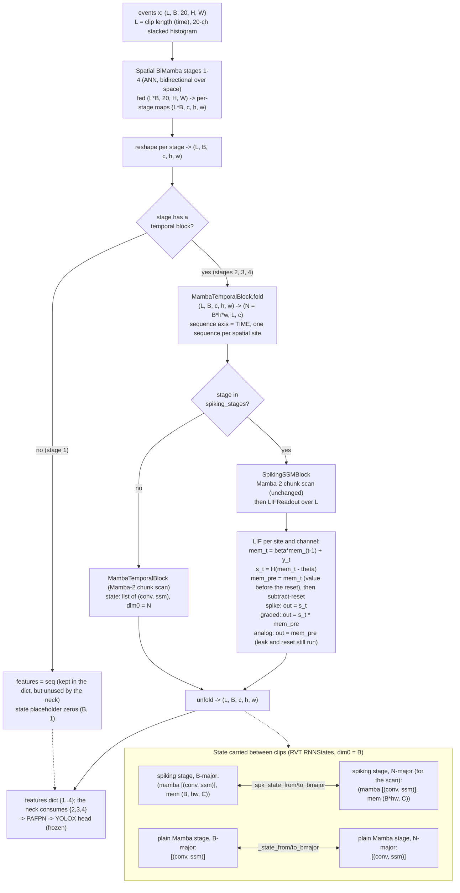

# Stage 18 — SpikingSSM Backbone Integration: Notes and Decision Record

**Thesis C · MMAN4953 · UNSW Sydney · Benas Vaiciulis** · 2026-10-06 · **Branch:** `stage18-spikingssm` (base `287b996`)
**Spec:** `docs/specs/2026-10-06-stage18-spikingssm-integration-design.md` · **Plan:** `docs/plans/2026-10-06-stage18-spikingssm-integration.md`
**Predecessor:** `docs/notes/Stage17_build_notes.md` (spiking cell) · **Master plan:** `docs/plans/2026-09-07-thesis-c-plan.md`

This document is the complete reasoning record for Stage 18. It is written so that the thesis chapters can be drafted from it
without recourse to the (deleted) subagent workspace: every problem encountered, every decision taken, who took it, the
measured evidence behind it and where it belongs in the dissertation are recorded in §4. Numbers and commit SHAs are
quoted verbatim from the build and review logs.

---

## 1. What was built

Stage 18 makes the Stage-17 spiking temporal block selectable as a drop-in recurrent backbone for the frozen RVT pipeline
(PAFPN neck, YOLOX head, losses, Gen1 data, Prophesee evaluator, 400k-step recipe), exactly as PureSSM was integrated in Stage 12.

| Component | Location | Role |
|---|---|---|
| `SpikingSSMBackbone` | `code/event_ssm/models/spikingssm/backbone.py` | Subclass of the **unmodified** `ResNetMambaBackbone`. Swaps the temporal block on `spiking_stages` for `SpikingSSMBlock` (Mamba-2 + LIF readout) and overrides `forward` so every stage carries the correct state type. |
| `_spk_state_to_bmajor` / `_spk_state_from_bmajor` | same file | Spiking-aware state reshape helpers for the `(mamba_state, mem)` tuple (RVT stores dim0 = B; the scan needs dim0 = N = B·h·w). |
| `spiking_stats()` | same file | Per spiking stage: last firing rate, learned `beta` (mean/min/max) and `threshold` mean. Host sync — called at monitor cadence only. |
| Registry dispatch | `code/event_ssm/integration/register.py` | Additive `"SpikingSSM"` branch in `build_recurrent_backbone`; config modifier widened to the third name. Existing branches byte-identical. Unknown keys under `backbone.spiking` raise `ValueError` (D12). |
| `attach_spiking_monitor` | `code/event_ssm/integration/monitors.py` | Firing-rate watch: prints `[spk-monitor]` line each `every_n` forwards, warns on SILENT (< 0.01) and SATURATED (> 0.90), logs to W&B when a run is active. Default off. |
| Model config | `code/event_ssm/configs/spikingssm_yolox/default.yaml` | PureSSM model config + a `backbone.spiking` block. |
| Experiment config | `code/event_ssm/configs/experiment/gen1/spikingssm.yaml` | Recipe identical (OmegaConf-equal, test-enforced) to `puressm.yaml`; only the model group differs. |
| Symlink recipe | `docs/patches/README.md` ("Stage 18" section) | Re-creates the two Hydra symlinks into the gitignored `external/` RVT tree after a re-clone. |
| LIF precision and checkpoint-arm contracts (final review) | `models/spikingssm/lif.py`, `models/spikingssm/spiking_temporal.py` | The LIF recurrence runs in fp32 under bf16 autocast; the carried membrane is fp32 (D13). `LIFReadout` and `SpikingSSMBlock` store their ablation arm in the state_dict and refuse to load a checkpoint trained as a different arm (D14). |
| Tests | `code/event_ssm/tests/models/spikingssm/` | 46 new non-GPU tests (23 in the build, 23 in the final-review fix wave), 15 GPU tests in `test_backbone_gpu.py` (see §6). |

**Selection:**

```bash
model=rnndet +experiment/gen1=spikingssm
```

**Launcher status (corrected after the final review, D15).** An earlier version of this note claimed that training, test
evaluation and the Stage-10 benchmark all work unchanged. Only training does:

| Launcher | Works unchanged? | Why / what is missing |
|---|---|---|
| Training, `code/event_ssm/scripts/stage7_midrun_local.sh` | **Yes** | `EXPERIMENT=spikingssm` (the knob in `stage6_overrides.sh`, default `resnet_mamba`) selects the model; arm overrides pass through `"$@"` (l.65). |
| Test evaluation, `code/event_ssm/scripts/stage14_puressm_test_eval_local.sh` | **No** | Hardcodes `+experiment/gen1=puressm` (l.63). Stage-21 work. |
| Stage-10 benchmark, `code/event_ssm/benchmark/bench_models.py` | **No** | No `spikingssm` entry. `temporal_hparams()` iterates `block.layers` (l.148), but `SpikingSSMBlock` keeps its Mamba layers at `.ssm.layers`, so it raises `AttributeError`. The torch.profiler FLOP count (`bench_metrics.profiler_network_flops`, `with_flops=True`) does not attribute FLOPs to the LIF's elementwise ops. Stage-22 work, where the spiking metric is SOPs rather than MACs anyway. |

**Stage-17 corrections made inside this stage** (D6 and D7 in §4): the `LIFReadout` constructor now rejects `beta` at the
epsilon boundary (it previously passed validation and then crashed with `math.log(0)`), and the per-forward host sync on the
firing rate was removed. Both are in commit `32ccb7e`; all 31 Stage-17 CPU tests passed unmodified.

**Final-review fix wave** (D13–D15 in §4; minor items in §5): the LIF recurrence runs in fp32 under bf16 autocast (`f2b36f3`);
checkpoints carry their ablation arm (`560f6b7`); the carried membrane is returned detached like the Mamba state (`00d3023`); the
firing rate is reduced once per forward instead of once per timestep (`f335a23`); a regression test pins the copied PureSSM
construction in the `register.py` branch (`93c27a8`); the package `__init__` docstring is corrected (`a85e971`).

### 1.1 Data and state flow (one backbone forward)



Two properties of the state contract are load-bearing. First, `mem` is deliberately shaped `(N, C)` with dim0 = N, so the same
`(N, ...) <-> (B, hw, ...)` reshape that the parent applies to the Mamba state applies to the membrane; RVT's
`RNNStates.recursive_detach` / `recursive_reset` recurse through nested lists and tuples, so **no RVT change is required** and zeroing
`mem` on a sequence reset is the correct LIF reset. Second, the choice between the plain and the spiking helper is made **per stage**,
which is what makes the mixed ladder `spiking_stages=[4]` (plain stages 2–3, spiking stage 4 in one forward) a distinct code path
that required its own tests (D11).

---

## 2. Ablation-arm cheat-sheet (every arm is a CLI override)

All overrides are appended to `model=rnndet +experiment/gen1=spikingssm`. The recipe, neck, head, losses and data are frozen; only the
model group differs from PureSSM.

| Purpose | Override | Note |
|---|---|---|
| Output-mode decomposition (headline) | `model.backbone.spiking.output_mode={spike,graded,analog}` | `analog` keeps leak and subtract-reset (D9); it is **not** a PureSSM copy. |
| De-risking ladder | `model.backbone.spiking.spiking_stages=[4]` then `[3,4]` then `[2,3,4]` | Must be a subset of `in_stages` (validated before anything is built). `[2,3,4]` is the default. |
| Integration null test | `model.backbone.spiking.spiking_stages=[]` | A valid override (composes to an empty tuple): no stage spikes, so the model reproduces PureSSM numerically. Proven by `test_no_spiking_stages_equals_puressm` (all-ANN path). It is a wiring check, not an experimental arm. |
| Energy–accuracy Pareto | `model.backbone.spiking.threshold=<value>` | Higher threshold gives sparser firing, fewer SOPs, lower energy. Do not report a single operating point. Evaluating a checkpoint at a threshold (or fixed `beta`) other than the one it was trained with needs `SPIKING_ALLOW_ARM_OVERRIDE=1`; without it the load raises (D14). |
| Evaluating any checkpoint | repeat the overrides the checkpoint was trained with | The checkpoint carries its arm (D14). A mismatch in `output_mode`, `reset`, `alpha`, `detach_reset`, `learn_beta`, `learn_threshold` or `residual` raises `ValueError` naming each key; no flag overrides these. |
| Analog bypass (escape hatch) | `model.backbone.spiking.residual=True` | **Must be reported if used**: it weakens the spiking claim. |
| Other LIF knobs | `...spiking.{beta,alpha,learn_beta,learn_threshold,reset,detach_reset}` | Forwarded verbatim to `LIFReadout` through `_LIF_KEYS` in `register.py`; each is pinned by a test at a non-default value. A misspelled key under `spiking:` raises `ValueError` (D12). |
| Silence/saturation watch | `SPIKING_MONITOR=1 SPIKING_MONITOR_EVERY=200` | Env vars, default off, zero overhead when unset. Composes with `PURESSM_MONITOR=1` (spatial norms). |
| Local 16 GB card | `model.backbone.checkpoint_blocks=True` | As for PureSSM, whose Stage-11 probe measured 8.55 GB for checkpointed training and whose Stage-12 smoke used this override. The LIF time loop adds activations on the spiking stages: **re-measure peak VRAM at Stage 19** rather than assuming PureSSM's figure carries over. |

---

## 3. Verification at a glance

| Check | Result |
|---|---|
| Full default suite, `pytest code/event_ssm/tests/ -q` (repo root), after the final-review fix wave | **189 passed, 27 deselected (gpu-marked), 27 warnings in 75.98 s**, 0 failures. Before the fix wave: 166 passed, 25 deselected in 75.42 s (and 161 passed in 72.05 s before the D12 fix round). Baseline before Stage 18 was 143 non-GPU tests; 189 − 143 = **46 new non-GPU tests**: 23 in the build (lif +5, `test_backbone_cpu` 3, `test_register_spikingssm` 11, `test_spiking_monitor` 4) and 23 in the fix wave (lif +17: F1 3, F8 1, F2 13; `test_spiking_temporal_cpu` +3: F7 1, F2 2; `test_backbone_cpu` +1: F2; `test_register_spikingssm` +2: F4). |
| Spiking GPU session after the fix wave, `pytest code/event_ssm/tests/models/spikingssm/ -m gpu -q` (RTX 5070 Ti idle at the guard: 6 % utilisation / 1270 MiB; no compute processes listed by `nvidia-smi`) | **24 passed, 77 deselected in 42.84 s** = 9 Stage-17 gpu tests + 15 in `test_backbone_gpu.py` (13 from the build + the D13 bf16-autocast test over 2 ladder rungs). The full spiking GPU set also passed 24/24 after each of the F1, F8, F7 and F2 commits (guard 6–8 % / ≤ 1288 MiB each time). Before the fix wave: 22 passed in 33.42 s and 34.58 s (two runs; guard 4 % / 1315 MiB and 2 % / 1534 MiB). |
| Spiking package, all tests | 101 collected = 77 non-GPU + 24 GPU (before the fix wave: 76 = 54 + 22). |
| Frozen packages, `git diff --stat main -- code/event_ssm/models/eventssm code/event_ssm/models/puressm code/event_ssm/temporal code/event_ssm/backbone` | **Empty (exit 0)**, re-checked after the fix wave: nothing in the frozen model/temporal/backbone code is modified. |
| Files changed vs `main` under `code/event_ssm/` | Only: `models/spikingssm/{__init__,backbone,lif,spiking_temporal}.py`, `integration/{register,monitors}.py` (additive), two new config files, and tests under `tests/models/spikingssm/`. Plus `docs/patches/README.md` (symlink recipe). The fix wave did not touch `integration/` (`git diff 8c9754f -- code/event_ssm/integration/` is empty). |
| Task-1 deferred item "GPU parity test tolerance tightened 1e-3 to 1e-5, unverified on GPU" | **Verified**: `test_ssm_path_matches_the_non_spiking_block` passes at 1e-5 (both GPU runs). No relaxation needed. |

Model-config and recipe parity with PureSSM is enforced by tests, not by convention: `test_recipe_identical_to_puressm` (the experiment
yaml equals `puressm.yaml` once the `defaults` list is removed) and `test_model_config_identical_to_puressm_except_spiking` (the model
yaml equals `puressm_yolox/default.yaml` once `name` and the `spiking` block are removed). This is what licenses the statement that
any mAP delta against PureSSM is attributable to the spiking readout.

---

## 4. Problems found and decisions

Format for every item: symptom or question, evidence, root cause or options considered, decision and who made it
("user" = explicit decision by the thesis author; "plan" = fixed by the agreed Stage-18 plan; "controller/assistant" = a process choice
made while executing the plan; "final review" = a fix or correction required by the whole-branch final review), consequence, and where
it is used in the thesis.

### D1. Schedule position when Stage 18 started

- **Question.** Where does Stage 18 sit relative to the Thesis-C timeline, and how much slack is left?
- **Evidence.** 2026-10-06 is Week 4 of the timeline, the **kill-switch week** (decision due Sunday 11 October). The timeline had
  budgeted Stage 18 for Week 1, Stage 19 (smoke) for Week 2 and Stage 20a for Week 3. Nothing spiking was trainable on 6 October.
- **Decision (user, with the plan).** Stage 18 now, as roughly one day of CPU-side development; then Stage 19 smoke **locally** on the
  5070 Ti (PureSSM's checkpointed training peaks at ≈ 8.6 GB in the Stage-11 probe, which fits the 16 GB card, so no cloud rental is
  planned; to be re-confirmed with the LIF activations at Stage 19); then the 25k short run
  locally; then an honest kill-switch call on measured stability rather than on intent.
- **Consequence.** The kill-switch criterion ("is the spiking model training stably?") will be evaluated on the Stage-19/short-run
  evidence, not on this integration alone. The schedule slip is itself a reportable risk-register entry.
- **Thesis use.** Ch.7 and the timeline/risk appendices (how the kill-switch was applied; schedule slip against plan).

### D2. Design: subclass, do not edit

- **Question.** How is a spiking backbone added without perturbing the controlled comparison?
- **Decision (plan).** `SpikingSSMBackbone` subclasses the unmodified `ResNetMambaBackbone`. The skeleton is PureSSM (BiMamba spatial
  stages stay ANN: choice C). Only the temporal readout on `spiking_stages` changes, so any mAP difference against PureSSM is
  attributable to the spiking readout alone. `spiking_stages ⊆ temporal_stages` exposes the de-risking ladder
  (`[4]` → `[3,4]` → `[2,3,4]`) as a single config value; a violating configuration raises `ValueError` before anything is built,
  because a spiking stage with no temporal block would be silently ignored and would mislabel an ablation arm.
- **Consequence.** The four frozen paths (`models/eventssm`, `models/puressm`, `temporal`, `backbone/resnet_mamba.py`) show an empty
  `git diff` against `main` (§3).
- **Thesis use.** Ch.3 Methodology (architecture of the spiking model; the controlled-ablation argument).

### D3. Dispatch through an additive branch in `register.py`

- **Options.** (a) An additive `"SpikingSSM"` branch in the shared harness entry point (the Stage-12 precedent for PureSSM).
  (b) Zero-edit chaining through a new `spikingssm/register.py` with duplicated train/eval launchers.
- **Decision (user): (a).** The model is then selectable by every launcher that takes the experiment as a parameter, and option
  (b) would have duplicated the launchers and invited recipe drift between models. **Corrected after the final review (D15):** an
  earlier version of this item claimed that every existing launcher (training, test evaluation, the Stage-10 benchmark) works
  unchanged. Only training does (`stage7_midrun_local.sh` via `EXPERIMENT=spikingssm` and its `"$@"` passthrough). The test-eval
  script hardcodes `+experiment/gen1=puressm`, and the Stage-10 benchmark has no `spikingssm` entry and would raise in
  `temporal_hparams()`; see the launcher table in §1. That launcher work belongs to Stages 21 and 22.
- **Consequence.** One of exactly **two** additive edits to pre-existing harness code: this `register.py` dispatch branch (plus the
  entry in the config-modifier name tuple) and `attach_spiking_monitor` appended to `integration/monitors.py`. The existing branches and
  functions are unchanged (the ResNetMamba and PureSSM branches are byte-identical).
- **Thesis use.** Ch.4 Experimental Setup (one harness, four models; why recipe drift is excluded by construction).

### D4. Plan-mandated duplication governs

- **Question.** `SpikingSSMBackbone.forward` repeats the parent's forward loop (≈ 20 lines; only the per-stage state-helper choice
  differs), and the register branch repeats PureSSM's BiMamba construction (≈ 7 lines). Should this be refactored away?
- **Decision (user, pre-flight ruling): no.** Refactoring for DRY would require editing the frozen files and would break the
  "byte-identical" guarantee on which the ablation's credibility rests. The reviewer verified there is no drift
  (`models/spikingssm/backbone.py:80-105` against `backbone/resnet_mamba.py:63-84`) and the null test (D2, `spiking_stages=[]`)
  guards the all-ANN path numerically. Reviewer duplication findings for Tasks 2 and 3 were parked under this ruling. The copied
  construction in `register.py` is now pinned by its own test (`test_null_spiking_build_matches_puressm_build`, commit `93c27a8`):
  PureSSM and SpikingSSM with `spiking_stages=[]`, built through `build_recurrent_backbone` from the composed configs, must have
  identical state_dict key→shape maps, `checkpoint_blocks` and DropPath probabilities, both for the shipped config and with every
  copied argument at a non-default value. Mutation check: 8 drift or dropped-key mutations of the SpikingSSM branch all fail it;
  7 of them fail only in the non-default case, because the shipped yaml uses the branch defaults (the D12 lesson again).
- **Consequence.** A deliberate, documented duplication; revisit only if the parent forward is ever changed (the null test will fail
  loudly if the two diverge).
- **Thesis use.** Ch.3 (engineering rationale) and the reproducibility appendix (the byte-identical-frozen-code policy).

### D5. Process: branch in place, not a git worktree

- **Process choice (controller/assistant; neither the plan nor the user decided this, and the plan never mentions worktrees).**
  `external/` (RVT) is gitignored and the tests resolve it relative to the repository, so a worktree would not contain it. Work was done
  on branch `stage18-spikingssm` in the main checkout.
- **Thesis use.** Reproducibility appendix (environment/tooling note only).

### D6. Latent Stage-17 bug: `beta == eps` crashed `LIFReadout` construction

- **Symptom.** `LIFReadout(4, beta=1e-4)` raised `ValueError: math domain error`. Found while writing the Stage-18 plan.
- **Root cause.** The constructor validated only `0 < beta < 1`. The epsilon-squeezed sigmoid `beta = eps + (1−2·eps)·sigmoid(logit)`
  (Stage-17 fix for float32 saturation) needs `eps < beta < 1−eps` to be invertible; at `beta = eps = 1e-4` the inverse yields
  `p = 0` and `log(0)`.
- **Impact.** The pending Stage-17 GPU test `test_ssm_path_matches_the_non_spiking_block` used exactly `beta = 1e-4`. It would have
  crashed in the constructor before asserting anything. Because the GPU tests had never run (pending an idle card), the defect had
  gone unseen.
- **Fix (commit `32ccb7e`).** The constructor asserts the open interval with an explanatory message. The test was rewritten: it now
  compares `block(x)` against `lif(weight-identical MambaTemporalBlock(x))`, an **exact identity** checked at tolerance 1e-5
  (previously the approximate argument "beta → 0 reduces to plain Mamba" at 1e-3). New tests: `beta ∈ {1e-4, 1−1e-4, 1e-5}` rejected
  cleanly; `beta = 2e-4` (just inside) initialises exactly.
- **Evidence the fix holds.** The tightened 1e-5 test passes on the GPU in this stage's verification (both runs).
- **Thesis use.** Reproducibility/testing appendix: an example of a numerical edge case discovered only when a deferred hardware test was
  scrutinised, and of replacing an approximate equivalence with an exact one.

### D7. Stage-17 performance defect: per-forward GPU-to-host sync on the firing rate

- **Symptom.** `LIFReadout.forward` ended with `float(spike_sum / L)`, forcing a device synchronisation once per spiking stage per
  step.
- **Impact.** It would have biased the Stage-22 latency and energy numbers (and slowed training marginally), contaminating exactly the
  quantity the efficiency pillar reports.
- **Fix (commit `32ccb7e`).** A detached 0-d tensor is stored; the `last_firing_rate` property converts to `float` only when read,
  i.e. at monitor cadence. Outputs are unchanged and all 31 Stage-17 CPU tests passed untouched.
- **Residual.** The lazy-tensor test checks that a tensor is stored, which is a proxy for the absence of a sync (deferred minor, §5).
  Reading `last_firing_rate` inside a CUDA-graph capture is unsupported (it syncs); relevant only if the Stage-22 deployment column
  uses graph replay for the spiking model.
- **Thesis use.** Ch.4 Experimental Setup (benchmark hygiene, alongside the Stage-10 contamination guards and idle-GPU fail-closed guard).

### D8. Streaming-parity criterion for a spiking model

- **Symptom.** In the first Task-2 GPU run, `test_streaming_two_clips_equals_one_clip[analog]` and `[graded]` failed with
  max|diff| = 1.0–1.8, against a planned max-absolute tolerance of 1e-3. The `spike` case passed its fraction criterion.
- **Evidence.** Only 1e-5 to 1.6e-4 of the elements deviated by more than 1e-3; the non-flipped elements agreed to ≈ 3e-4. Stage-4
  outliers were already present in **clip A (the first two frames, with no carried state)**, so the deviation is not a state-carry
  bug.
- **Root cause.** The Mamba-2 chunk scan is numerically length-dependent (≈ 1e-4 between L = 2 and L = 4). A membrane that sits
  within that noise of the threshold fires in one run and not in the other; with subtract-reset the membrane then differs by
  `threshold` (1.0) for every later step. That is an O(1) jump on isolated elements in **every** output mode (analog included, which
  still resets: see D9).
- **Options.** (1) A fraction criterion only. (2) A fraction criterion for all modes plus one strict max-absolute case with spiking
  disabled (`threshold = 1e6`, asserting zero firing). (3) Keep 1e-3 and investigate further.
- **Decision (user, 2026-10-06): option 2.** The strict case keeps a tight check of the Mamba-state and membrane carry that cannot hide
  behind the fraction allowance. Implemented in commit `986b64e`.
- **Measured result** (commit `986b64e`, GPU 8/8 pass; table in §4.1): worst fraction |diff| > 1e-3 is at most 1.6e-4 against a bound of 1e-3; the strict no-spike
  case reports firing rate exactly 0.0 and max|split − full| of 3.1e-4 / 4.2e-4 / 8.7e-4 against scale-relative allowances of
  5.0e-3 / 4.4e-3 / 4.3e-3 (stages 2/3/4).
- **Consequence and broader point.** A thresholded model amplifies floating-point noise into discrete flips, so **bit-level equality
  between streaming and batched (or differently chunked) evaluation is not achievable; parity must be statistical.** This applies to the
  Stage-21 evaluation reproducibility and to any streaming-versus-offline comparison of the spiking model.
- **Thesis use.** Ch.3/4 (verification of the recurrent-state contract) and Ch.6 Discussion (threshold sensitivity and numerical
  reproducibility of SNNs).

### D9. What the `analog` arm actually is (pre-registration revised)

- **Observation.** In `LIFReadout`, analog mode outputs the pre-reset membrane but **still applies leak (`beta`) and subtract-reset to
  the carried state**. It is not a copy of PureSSM's temporal output.
- **Consequence for the pre-registration.** The earlier claim "`analog` ≈ 46.4 (PureSSM), otherwise the integration is broken" is not a
  valid diagnostic: a gap could come entirely from the LIF dynamics, not from a wiring error.
- **Options.** (1) Keep the code and reframe the pre-registration. (2) Make analog skip the reset (a pure leaky integrator), closer to
  PureSSM; but then analog and graded would use different membrane dynamics and analog → graded would no longer isolate sparsity.
  (3) Defer to Stage 19.
- **Decision (user, 2026-10-06): option 1; the code is unchanged.**
  - **Integration check** = the `spiking_stages=[]` null test, proven numerically identical to PureSSM
    (`test_no_spiking_stages_equals_puressm`, `atol = 1e-6` on all four feature maps). The null test covers the all-ANN path only; the
    spiking-path wiring is verified by the D6 exact-identity test (block ≡ LIF(weight-identical Mamba)) and the streaming/strict
    state-carry tests (D8, D11).
  - **Results ladder, all arms sharing one membrane:** PureSSM → `analog` (cost of the LIF dynamics: leak plus reset) → `graded`
    (cost of sparsity) → `spike` (cost of binarisation). The expected ordering `analog ≥ graded > spike` stands, and all three gaps are
    reported whatever their size.
- **Where the reframing was applied:** `CLAUDE.md` pre-registration bullet (a) and (c); `thesis/latex/main.tex` (`\tbd` in
  `sec:spiking_results`, the Readout-modes paragraph and the ablation-table row label); dated inline notes in
  `docs/plans/2026-09-07-thesis-c-plan.md` and `docs/notes/Stage17_build_notes.md`.
- **Stale wording, now corrected (comment-only, commit `6ea0ed0`).** The `lif.py` module docstring and the inline comment on the
  analog branch ("`analog` … the control arm"), and the `# analog = control arm, should ≈ PureSSM 46.4` comment in
  `configs/spikingssm_yolox/default.yaml:26`, were wrong in the sense of D9 and were rewritten; the behaviour was always as described
  here. The spec/plan quotations of that comment are frozen documents and remain as written. No logic changed; all Stage-17 LIF tests
  pass untouched.
- **Further stale wording, now updated (commit `8c9754f`).** `thesis/latex/main.tex` §Readout modes (previously "analog ($m_t$, no
  spiking --- a control arm that isolates the cost of sparsity from the cost of binarisation)") now states the D9 framing, and the
  ablation-table row label "analog (control)" is now "analog (dense LIF)". `docs/notes/Stage17_build_notes.md` Decision 4
  ("`analog` ... the control arm — A/B against `spike` measures the exact cost of spiking") carries a dated inline note (history is not
  rewritten). Not editable under the fix-round rules and still using "control arm": `thesis/inrc_proposal/inrc_loihi_proposal.tex`
  (l.72–73, "analog (the control arm)") — the INRC proposal should be re-read for this before it is sent. (Its l.80 section title "What is
  already built (the control arm)" refers to the non-spiking baselines and is unaffected.)
- **Thesis use.** Ch.3 Methodology (readout modes; what each arm holds fixed), Ch.5 §5.7 results structure (a four-rung ladder with
  three gaps) and Ch.6 Discussion (what "the cost of spiking" decomposes into).

### D10. Open items found in the repository review (not Stage-18 scope, not fixed here)

- `thesis/latex/main.tex` has duplicate labels `app:maths` (l.956–957) and `app:risk` (l.1041, 1045), producing LaTeX warnings.
- The risk table uses `[h!]` instead of `[htbp]` (project float rule) and carries a stale comment near l.1038.
- `thesis/supervisor_report/` is untracked and contains LaTeX build artefacts; it must not be committed.
- **Disposition.** Recorded only; the dissertation tidy-up is a separate task. This stage changed `main.tex` in **three places**, all of
  them D9 wording: the Readout-modes paragraph (≈ l.557, `8c9754f`), the `\tbd` note in `sec:spiking_results` (≈ l.824, `f891c84`)
  and the ablation-table row label "analog (control)" → "analog (dense LIF)" (≈ l.839, `8c9754f`). It introduced no new label or
  float. (An earlier version of this item said "exactly one sentence"; corrected after the final review.)
- **Thesis use.** None (housekeeping).

### D11. Pre-merge test hardening: NaN-blind parity and the untested mixed ladder

- **Question (review follow-up).** Are the fraction-based parity tests, introduced by D8, strong enough?
- **Gap (a): NaN blindness.** `NaN.abs() > 1e-3` evaluates to `False`, so a NaN in the carried graded or spike state would count as
  "not deviating" and the test would pass.
- **Gap (b): the first rung of the ladder was untested.** `spiking_stages=[4]` (plain Mamba stages 2–3 and a spiking stage 4 in one
  forward) was covered only for block placement, never for a forward, streaming or reset pass, even though it is the intended Stage-19
  starting configuration and the only path that exercises the per-stage choice between plain and spiking state helpers.
- **Decision (user, 2026-10-06): fix both before merge.** Implemented in commit `5f27290`: an `isfinite` guard precedes the fraction check;
  the streaming, strict and RVT-reset tests are parametrised over `spiking_stages ∈ {[2,3,4], [4]}`; the strict test now also asserts zero
  firing after the first clip. The reset test confirms that stage 2 keeps the plain Mamba state and stage 4 the `(mamba, mem)` state, both
  zeroed for the reset sequence, and that the backbone resumes from the reset state.
- **Measured (mixed ladder `[4]`)** in the table of §4.1.
- **Result.** GPU session 13/13 in `test_backbone_gpu.py` at that commit; 22/22 for the whole spiking GPU set at the head of the branch.
- **Thesis use.** Reproducibility/testing appendix (verification coverage of the ablation configurations; why a parity test must guard
  against NaN).

### D12. Review finding: silent-misconfiguration paths in the config-to-model wiring

- **Finding (Task-4 review, important).** `test_lif_kwargs_flow_from_config` set only `output_mode`, `threshold`, `learn_threshold`,
  `reset` and `residual` to non-default values; `beta`, `alpha`, `learn_beta` and `detach_reset` were tested *at* their `LIFReadout`
  defaults. If any of them stopped being forwarded (for example dropped from `_LIF_KEYS`), `spiking.beta=0.8` would have been silently
  ignored in an ablation run and the test would still have passed. The code was correct; the regression net had a hole.
- **Minor findings.** (i) Unknown keys under `spiking:` were silently dropped by `{k: spk[k] for k in _LIF_KEYS if k in spk}`: a
  typo'd `+model.backbone.spiking.outptu_mode=analog` composed (Hydra's `+` appends a new key) and ran the *default* arm. A plain,
  non-`+` CLI typo already fails loudly through Hydra struct mode, so only the append form and hand-written configs were exposed.
  (ii) The `SPIKING_MONITOR` / `SPIKING_MONITOR_EVERY` env wiring in the builder had no test.
- **Why it matters.** In an ablation study the dangerous failure is not a crash but a run that silently measures the wrong arm and is
  reported under the right label.
- **Decision (user, 2026-10-06): fix all three before merge.** Implemented in commit `dc7f56c`:
  - all eight `_LIF_KEYS` plus `residual` are set to non-default values (`analog`, `beta=0.7`, `threshold=0.5`, `alpha=4.0`,
    `learn_beta=False`, `learn_threshold=True`, `reset=zero`, `detach_reset=False`, `residual=True`) and asserted on **every** spiking
    stage, not only the last. Mutation check: removing any one of `beta`, `alpha`, `learn_beta`, `detach_reset` from the forwarded set
    makes the test fail at stage 2 (all four verified);
  - the SpikingSSM branch raises `ValueError` listing the unknown and the allowed keys, before the (expensive) spatial stack is built.
    A missing `spiking:` block keeps its documented behaviour (LIF defaults on every temporal stage), now pinned by a test. Tested at
    builder level and end-to-end through Hydra compose with a `+`-appended typo;
  - the env gate is tested both ways (`[spk-monitor]` line appears with `SPIKING_MONITOR=1`, absent when unset), mirroring
    `tests/test_monitors.py`.
- **Result.** 5 new tests; default suite 161 to 166 passed. The ResNetMamba and PureSSM branches and the frozen packages are untouched.
- **Thesis use.** Ch.4 Experimental Setup and the reproducibility appendix (configuration-integrity safeguards: an ablation arm cannot
  be mislabelled by a misspelled or unforwarded key).

### D13. Final review (critical): the LIF membrane ran in bf16 under every real launcher

- **Symptom.** None in the test suite: every GPU parity test casts the model to `.float()`. The whole-branch final review found it by
  reading the launchers rather than the tests.
- **Evidence.** The experiment yaml sets `training.precision: 32`, but every launcher overrides it to bf16-mixed: `stage6_overrides.sh`
  (`PRECISION`, default `bf16-mixed` in `stage7_midrun_local.sh` and `stage13_cloud_short.sh`), the Stage-14 test-eval script (l.69) and
  `proofs/smoke_overfit_puressm.py` (l.56). Under autocast, Mamba's `out_proj` returns bf16, and `lif.py` built `mem` with `x.new_zeros`
  and cast `beta`/`threshold` to `x.dtype`, so the whole recurrence ran in bf16. Rounding verified on CPU by the controller: `beta`
  0.999 → exactly 1.0 in bf16; 0.995 and 0.998 → 0.996094; 0.99 → 0.988281; and 1.0 + 0.003 = 1.0. The reviewer measured 0.04–0.27 %
  spike flips bf16-vs-fp32 on identical inputs, 3–17× the 1.6e-4 noise floor of D8. The failing (RED) run of the new CPU tests
  reproduced it: 2.21e-3 (0.22 %) of spikes flipped on a (256, 32, 64) bf16 input, and a bf16 unit pulse with `beta = 0.999` left
  `mem = 1.0` exactly after 200 steps (a pure integrator; the fp32 answer is 0.999^199 ≈ 0.819).
- **Root cause.** The LIF state inherited its dtype from its input. The fp32 upcast in `surrogate.py` acts only in the backward pass
  and came after `u = mem − thr` was already quantised.
- **Consequences if unfixed.** Any β above ≈ 0.998 (precisely, above the bf16 rounding midpoint 0.998047 between 0.996094 and 1.0)
  silently becomes a pure integrator, which is exactly the failure the Stage-17
  epsilon-squeeze was built to prevent. Small inputs vanish against a large membrane. The β the monitor reports (the fp32 parameter)
  is not the β the forward used, so the planned "learned-β distribution / multi-timescale" result would be measured on the wrong
  neuron.
- **Decision (final review: critical, fix required before any spiking checkpoint exists).**
- **Fix (commit `f2b36f3`).** `LIFReadout.forward` upcasts the input (`x.float()`), keeps `mem`, `beta` and `threshold` in fp32 and
  runs the loop in fp32. The output is cast back to the input dtype, so the neck sees bf16 as it did for PureSSM. The carried `mem`
  is returned in fp32 **by contract**, like any numerically sensitive accumulator, so it is never re-quantised between clips either.
  Elementwise ops are not on autocast's cast lists, so fp32 operands stay fp32 inside the autocast region. For fp32 input both casts
  are no-ops and the fp32 path is bit-unchanged: every pre-existing test passed with unchanged tolerances, and the §4.1 parity
  numbers (measured in fp32) still stand.
- **Tests.** CPU (`test_lif.py`): bf16 output dtype with spikes exactly equal to the fp32 recurrence on the same values; carried `mem`
  fp32 for bf16 input; the leak survives bf16 (`mem ≈ 0.999^199`, abs 1e-4). GPU (`test_backbone_gpu.py`, both ladder rungs): under
  `torch.autocast("cuda", dtype=torch.bfloat16)` the stage-2/3/4 features are bf16 and every spiking stage's carried `mem` is fp32.
  All of them failed before the fix (2.21e-3 flips; `mem` bf16; `mem = 1.0`; GPU `mem` bf16 at stages 2 and 4) and pass after it.
- **Thesis use.** Ch.4 Experimental Setup (numerical precision of the neuron model) and Ch.6 Discussion (mixed precision and SNN
  state: a general pitfall for spiking layers under AMP).

### D14. Final review (important): a checkpoint did not record which ablation arm it was trained as

- **Finding.** RVT evaluation rebuilds the model from the CLI config (`validation.py:63`, `load_from_checkpoint(ckpt, full_config=…)`;
  RVT never calls `save_hyperparameters`). `output_mode`, `reset`, `residual`, `alpha` and `detach_reset` were plain attributes, so an
  analog-trained checkpoint evaluated without repeating its overrides loaded strictly and was **silently scored as `spike`**.
  Conversely, a non-learned `beta_logit`/`threshold_raw` is a persistent buffer, so the checkpoint value **silently overrode** an
  eval-time `spiking.threshold=`, and a post-hoc threshold sweep (the Stage-22 energy–accuracy Pareto) would have measured one operating
  point repeatedly.
- **Why now.** It had to land before the first spiking checkpoint exists (Stages 19/20).
- **Decision (user, 2026-10-06): store the arm in the checkpoint; error on a mismatch; an explicit override flag for deliberate
  operating-point sweeps.** Semantics as implemented (commit `560f6b7`):
  - `LIFReadout.get_extra_state()` stores `version` (= 1), `output_mode`, `reset`, `alpha`, `detach_reset`, `learn_beta`,
    `learn_threshold` and, only when *not* learned, the fixed `beta` and `threshold` (floats; the buffers are constant-filled per
    channel). The values are read back from the buffers, not from the config, so the record states what the forward actually uses.
    `beta_logit`/`threshold_raw` stay registered exactly as before: state_dict key names are unchanged.
  - The constructor keeps the config-requested fixed `beta`/`threshold`, because by the time `set_extra_state` runs the buffers already
    hold the checkpoint values. PyTorch calls `set_extra_state` *after* the module's own parameters and buffers are copied; this was
    checked against `nn.Module._load_from_state_dict` in the installed torch 2.11.0, and an exception there propagates out of
    `load_state_dict`.
  - Any mismatch in `output_mode`, `reset`, `alpha`, `detach_reset`, `learn_beta` or `learn_threshold` raises `ValueError` naming every
    mismatched key with its checkpoint and config values, and saying that the checkpoint was trained as a different ablation arm.
    These keys have no override.
  - A mismatch only in a non-learned `threshold` and/or `beta`: with `SPIKING_ALLOW_ARM_OVERRIDE=1` the load emits a `UserWarning`
    **and** prints a `[spiking] ARM OVERRIDE …` line, then re-fills `threshold_raw`/`beta_logit` from the **config** values (the config
    governs, e.g. for a threshold sweep). Without the variable it raises `ValueError` explaining the mismatch and naming the variable.
    The comparison uses a relative tolerance of 1e-5: the worst float32 round-trip error of a stored `beta`, measured over
    `beta ∈ [2e-4, 0.9998]` on CPU and CUDA, is 3.0e-7 relative.
  - A learned `beta`/`threshold` is never compared: the checkpoint holds the trained value, and the config only set its
    initialisation.
  - An unknown `version` (or a malformed record) raises `ValueError`.
  - `SpikingSSMBlock` stores `residual` the same way; a mismatch raises `ValueError`, with no override.
  - No extra state lives on `SpikingSSMBackbone` itself, so the strict cross-class null test against `ResNetMambaBackbone`
    (`spiking_stages=[]`, no spiking modules, hence no extra-state keys) still passes. The arm records sit at
    `temporal.<s>._extra_state` and `temporal.<s>.lif._extra_state`. The record is a dict of primitives, so it loads under
    `torch.load(weights_only=True)` as well.
- **Limitation (documented, RVT not edited).** `train.py:105` (`resume_only_weights`) loads with `strict=False`. On that path a
  checkpoint **missing** the `_extra_state` key would not be caught; a present key is still checked, because PyTorch calls
  `set_extra_state` whenever the key exists. No spiking checkpoint without the key can exist (the fix predates the first one). The
  evaluation path (`validation.py:63`) uses Lightning's default `strict_loading=True`, so a missing key is an error there.
- **Consequence.** Every evaluation of a spiking checkpoint must repeat the overrides it was trained with (the error message says so).
  The Stage-22 threshold Pareto runs with `SPIKING_ALLOW_ARM_OVERRIDE=1`, and those points are reported as post-hoc operating points
  of a checkpoint trained at a different threshold.
- **Test-mechanics change.** Two Stage-17 tests used `load_state_dict` as a weight copy *between* arms
  (`test_lif.py::test_output_modes[graded]`, graded → spike reference; `test_spiking_temporal_cpu.py::test_residual_switch`,
  `residual` False → True). Under the new contract those loads correctly raise. Both now copy tensors only, through a helper that
  leaves the arm record behind and stays strict on every tensor key. Their assertions and tolerances are unchanged.
- **Tests.** 16 new: LIF arm record contents (learned values absent); strict same-arm round trip with identical outputs (fixed and
  learned variants); analog checkpoint into a spike model raises naming `output_mode`; every mismatched key is named (and only those);
  a `learn_beta` mismatch raises; a fixed threshold (1.0 → 0.5) or beta (0.9 → 0.7) mismatch raises without the variable, and with it
  warns, prints and leaves the config value in force; the variable never excuses a categorical mismatch; a learned threshold's
  checkpoint value wins over a different config initialisation; unknown version raises; `SpikingSSMBlock` residual round trip and
  mismatch; and a backbone-level check of the nested key prefixes plus cross-arm errors raised from inside nested modules.
- **Thesis use.** Ch.4 Experimental Setup and the reproducibility appendix (self-describing checkpoints; how a post-hoc operating-point
  sweep is kept explicit).

### D15. Correction (final review, important): harness reuse was overstated in these notes

- **Finding.** §1 and D3 claimed that the training, test-eval and Stage-10 benchmark launchers all work unchanged. That is true for
  training only (`stage7_midrun_local.sh`: the `EXPERIMENT` knob plus `"$@"` passthrough).
  `stage14_puressm_test_eval_local.sh` hardcodes `+experiment/gen1=puressm`. `benchmark/bench_models.py` has no `spikingssm` entry, and
  its `temporal_hparams()` iterates `block.layers` while `SpikingSSMBlock` keeps its layers at `.ssm.layers`, so it would raise
  `AttributeError`. Profiler FLOP counting will not see the LIF's elementwise ops.
- **Decision (final review).** Correct the record now; the launcher work belongs to Stages 21 (test-eval) and 22 (benchmark: a
  `spikingssm` entry, `temporal_hparams` for the composed block, and SOP rather than MAC accounting for the LIF).
- **Where corrected.** §1 (launcher table) and D3, committed with this note update (`docs:` commit after `a85e971`). The
  `CLAUDE.md` Stage-18 bullet did not repeat the claim; it now states the launcher status (updated in the working tree only, since
  the project rule is that `CLAUDE.md` is not committed without an explicit request).
- **Thesis use.** Ch.4 Experimental Setup (what the shared harness does and does not cover for the fourth model).

### 4.1 Measured streaming-parity numbers (D8 and D11)

Setup: backbone with spatial depths (1,1,1,1), 64×96 frame, L = 4 split as 2 + 2, eval mode, seed 0/1. Columns are stages 2 / 3 / 4.
These numbers were logged during the build (`986b64e`, `5f27290`) and **re-measured on 2026-10-06 in the Task-5 verification session**;
the two sets agree to the digits shown (the only difference is 5.4e-4 / 9.8e-4 against the logged 5.5e-4 / 9.9e-4 in two strict cells,
i.e. last-digit run-to-run scan noise).

**Fraction of elements with |split − full| > 1e-3** (pass criterion: < 1e-3 per stage; also all outputs finite):

| Ladder | `analog` | `graded` | `spike` |
|---|---|---|---|
| `[2,3,4]` (all spiking) | 0 / 0 / 1.2e-4 | 1.0e-5 / 0 / 1.6e-4 | 1.0e-5 / 0 / 1.6e-4 |
| `[4]` (mixed ANN + spiking) | 0 / 0 / 8.1e-5 | 0 / 0 / 4.1e-5 | 0 / 0 / 4.1e-5 |

**Strict no-spike case** (`threshold = 1e6`, `analog` mode; firing rate asserted exactly 0.0 after the full pass and after each clip;
pass criterion: max|split − full| ≤ 1e-3 · max(1, max|full|)):

| Ladder | max|split − full| (stages 2 / 3 / 4) | Allowance (stages 2 / 3 / 4) | Margin (worst stage) |
|---|---|---|---|
| `[2,3,4]` | 3.1e-4 / 4.2e-4 / 8.7e-4 | 5.0e-3 / 4.4e-3 / 4.3e-3 | ≈ 5× |
| `[4]` | 1.8e-4 / 5.4e-4 / 9.8e-4 | 2.6e-3 / 2.2e-3 / 4.0e-3 | ≈ 4× |

Reading: the fraction criterion has ≥ 6× headroom (worst 1.6e-4 against 1e-3), and the strict case, which has no flips to hide behind,
passes with ≥ 4× headroom on the Mamba-state and membrane carry. The residual deviation is the chunk-scan length noise identified in D8.
These numbers still stand after the final-review fix wave: the tests run the model in fp32, where the D13 casts are no-ops (bit-unchanged
path), and the F7 detach and F8 rate change alter no output value. All of these tests passed again after every fix-wave commit.

---

## 5. Known limitations and deferred items

Source: the subagent-driven-development ledger and the final whole-branch review's triage (2026-10-06). Statuses: **Fixed/Resolved**
(closed on this branch, with its commit), **Deferred** (with the stage that owns it and why), **Parked** (user ruling), **Open** (needs
the user), **Known limitation** (kept deliberately).

| Origin | Item | Status |
|---|---|---|
| Task 1 | Lazy-rate test checks that a tensor is stored, not the absence of a sync (a proxy) | **Deferred to Stage 22**: before the latency run, add a GPU test that runs the forward under `torch.cuda.set_sync_debug_mode("error")` |
| Task 1 | GPU parity test tolerance tightened 1e-3 → 1e-5, unverified on GPU | **Resolved**: verified in both Task-5 GPU sessions (passes at 1e-5; no relaxation needed), and again in every fix-wave GPU run |
| Task 1 | `last_firing_rate` docstring could state that reading it inside CUDA-graph capture is unsupported | **Deferred to Stage 22**: if the deployment column uses graph replay for the spiking model, the monitor hook (which reads the rate, i.e. syncs) must be off during graph capture |
| Task 2 | Duplicated forward loop (`models/spikingssm/backbone.py:80-105` vs `backbone/resnet_mamba.py:63-84`) | **Parked** by user ruling D4 (no drift; null test guards it) |
| Task 2 | Fraction criterion is NaN-blind for graded/spike carry | **Fixed** `5f27290` (D11a) |
| Task 2 | Strict no-spike test did not assert zero firing after clip A | **Fixed** `5f27290` |
| Task 2 | No forward/streaming/reset test for the mixed ladder `spiking_stages=(4,)` | **Fixed** `5f27290` (D11b) |
| Task 2 | `spikingssm/__init__.py` docstring line 6 (121 characters) unwrapped; it also implied `SpikingSSMBackbone` was importable without `mamba_ssm` | **Fixed** `a85e971` (F9) |
| Task 2 | Parent builds and then discards `MambaTemporalBlock`s for the spiking stages (inherent to the subclass design) | **Deferred**: build-time cost only (design, D2) |
| Task 2 | Reset tests assert sequence 0 zeroed but not that the state was non-zero before the reset, nor that sequence 1 is untouched (would pass on an all-zero state or a reset-everything bug) | **Deferred** |
| Task 3 | A NaN firing rate trips neither SILENT nor SATURATED (NaN comparisons are False) | **Deferred**: a NaN membrane gives `(u >= 0) = False`, i.e. rate 0, so SILENT fires in practice; `PURESSM_MONITOR=1` provides the NaN watch on the features |
| Task 3 | Monitor boilerplate (cadence guard, W&B try/except) mirrors the spatial monitor | **Parked** (same ruling family as D4: append-only constraint) |
| Task 3 | No tests for the W&B key format / `commit=False`, boundary rates exactly 0.01 and 0.90, suppression when `spiking_stats` raises, or a repeat at the second cadence tick | **Deferred** |
| Stage 18 (D9) | Stale "analog = control arm, should ≈ PureSSM 46.4" wording in `lif.py` docstring and `configs/spikingssm_yolox/default.yaml:26` | **Fixed** (comment-only, commit `6ea0ed0`) |
| Stage 18 (D9) | Stale "control arm / no spiking" wording for `analog` in `main.tex` (Readout modes paragraph; table row "analog (control)") and in Stage-17 notes Decision 4 | **Fixed** `8c9754f` (Stage-17 notes via a dated inline note) |
| Stage 18 (D9) | `thesis/inrc_proposal/inrc_loihi_proposal.tex` l.72–73 still calls analog "the control arm" | **Open — the user must fix this before the proposal is sent** (external-facing document; not edited on this branch) |
| Task 4 | `test_lif_kwargs_flow_from_config` tested beta/alpha/learn_beta/detach_reset only at their defaults | **Fixed** `dc7f56c` (D12) |
| Task 4 | Unknown keys under `backbone.spiking` silently ignored (typo'd `+...spiking.outptu_mode` ran the default arm) | **Fixed** `dc7f56c` (D12); a typo in the block name itself is not caught (§5.1 a) |
| Task 4 | `SPIKING_MONITOR` env wiring untested | **Fixed** `dc7f56c` (D12) |
| Task 4 | Config headers said "byte-identical" where the guarantee is semantic (OmegaConf-equal) | **Resolved** `6ea0ed0` (headers now say "Identical (OmegaConf-equal, test-enforced)") |
| Task 4 | The unknown-key tests request the `device` fixture although they raise before any GPU use, so on a GPU-less machine they would error rather than skip | **Deferred** |
| Task 4 | A missing `spiking:` block silently uses the `LIFReadout` defaults (all temporal stages spiking, `spike` mode) | **Known limitation**, kept by decision: the shipped config always carries the block and the behaviour is pinned by `test_missing_spiking_block_uses_defaults` |
| Task 4 | The widened name tuple in `register_config_modifier` is one 112-character line (`register.py:132`) | **Deferred** (cosmetic; the Stage-12 one-line style) |
| Task 5 | `main.tex` `\tbd` in `sec:spiking_results` (≈ l.826) says integration correctness is established "by the null test", which covers the all-ANN path only (the spiking path is covered by the D6 identity and D8/D11 carry tests) | **Deferred** to when the §5.7 prose is written |
| D10 | `main.tex` duplicate labels, `[h!]` float, untracked `supervisor_report/` | **Open** — outside Stage-18 scope |
| Final review (D13) | LIF recurrence ran in bf16 under the bf16-mixed launchers | **Fixed** `f2b36f3` |
| Final review (D14) | Checkpoints did not record their ablation arm; fixed buffers silently beat an eval-time threshold | **Fixed** `560f6b7` |
| Final review (D15) | Notes overstated harness reuse (test-eval and Stage-10 benchmark do not work unchanged) | **Fixed** in these notes (§1, D3); the launchers themselves are Stage-21/22 work |
| Final review (F4) | The `register.py` copy of PureSSM's construction had no regression test | **Fixed** `93c27a8` (see D4) |
| Final review (F5, F6) | Stale `backbone.py:128-153` line references; D10 said `main.tex` changed in "exactly one sentence" (it was three places) | **Fixed** in these notes |
| Final review (F7) | `SpikingSSMBlock` returned the carried membrane attached to the graph, unlike the Mamba state (`temporal/_scan.py` detaches) | **Fixed** `00d3023`; training unaffected (RVT calls the backbone once per step and detaches between steps; no test backprops through a carried `mem`) |
| Final review (F8) | Firing-rate bookkeeping launched detach + mean + add kernels on every timestep | **Fixed** `f335a23`: one reduction after the loop (profiler test: 1 `aten::mean` per forward, was L) |

### 5.1 Known limitations (final review)

a. **A typo in the block name itself is not caught.** `+model.backbone.spikng.output_mode=analog` composes (Hydra's `+` appends a new
   key), the builder reads `backbone_cfg.get("spiking")`, finds the shipped block unchanged, and silently runs the shipped arm
   (`spike`, `spiking_stages=[2,3,4]`). Plain non-`+` typos fail loudly through Hydra struct mode, and a typo *inside* the block
   raises (D12).
b. **`MAMBA_STEP_SCALE` compensates Mamba's Δt but not the LIF β.** Any Stage-21 true-rate study of the spiking model must either state
   that the membrane decay is uncompensated or scale it consistently (β^step_scale per step).
c. **The monitor cannot see the membrane magnitude.** It reports firing rate and β/threshold summaries, so strong negative membrane
   drift (a neuron pinned far below threshold) is only visible as SILENT. Deferred.
d. **The firing rate averages over the ≈ 11 % zero-padded sites** (Gen1 240×304 padded to 256×320: 1 − 72 960/81 920 = 10.9 %). The
   Stage-22 SOP counts must exclude the padding and use rates measured at evaluation precision.

---

## 6. Test inventory

| File | Non-GPU | GPU | Covers |
|---|---|---|---|
| `test_surrogate.py` | 8 | – | arctan surrogate (Stage 17) |
| `test_lif.py` | 37 | – | LIF dynamics, modes, beta bounds (Stage 17) **+5** (build): lazy firing rate, `beta` at/beyond eps rejected (3), `beta = 2e-4` exact init. **+17** (final review): fp32 recurrence under bf16 input, fp32 carried `mem`, leak survives bf16 (D13, 3); one rate reduction per forward (F8, 1); checkpoint arm contract (D14, 13) |
| `test_spiking_temporal_cpu.py` | 11 | – | block composition logic (state threading, residual switch, firing-rate passthrough, fold/unfold re-export) with a stateful stand-in for Mamba-2 (Stage 17). **+3** (final review): carried `mem` detached (F7); `residual` arm stored, same-arm round trip and mismatch raises (D14, 2) |
| `test_spiking_temporal.py` | – | 9 | real Mamba-2 kernels (Stage 17); parity test rewritten per D6 |
| `test_backbone_cpu.py` | 4 | – | state-helper round-trip is exact; `None` passes through; subset validation. **+1** (final review): arm records at the nested prefixes, strict same-arm load, cross-arm errors from nested modules (D14) |
| `test_backbone_gpu.py` | – | 15 | block placement; forward/backward with gradient reaching the spatial stem; streaming parity (3 modes × 2 ladders = 6); strict no-spike carry (2 ladders); null test ≡ PureSSM; RVT detach/reset (2 ladders). **+2** (final review): bf16 autocast gives bf16 features and fp32 carried `mem` (D13, 2 ladders) |
| `test_register_spikingssm.py` | 13 | – | builder dispatch; all eight LIF keys plus `residual` flow from config at non-default values on every spiking stage; unknown `spiking:` key raises (builder and Hydra compose); missing block uses defaults; `SPIKING_MONITOR` env gate on and off; Hydra compose selects the model and sets `in_res_hw = (256, 320)`, `num_classes = 2`; CLI override selects an arm; recipe parity; model-config parity. **+2** (final review): null-spiking build ≡ PureSSM build key-for-key, shipped and non-default configs (F4) |
| `test_spiking_monitor.py` | 4 | – | `every_n < 1` raises at attach; report at cadence; SILENT/SATURATED flags; detach handle stops reporting |
| **Total** | **77** (of 189 in the whole suite) | **24** | |

---

## 7. Pre-registration for Stages 19–21 (revised by D9)

Commit before any result is seen:

1. **Integration is established by tests, not by an accuracy number.** The null test, `spiking_stages=[]` ≡ PureSSM (proven, GPU-tested),
   covers the all-ANN path only; the spiking-path wiring is verified by the D6 exact-identity test (block ≡ LIF(weight-identical Mamba))
   and the streaming/strict state-carry tests (D8, D11).
2. **Ladder sharing one membrane:** PureSSM (46.43) → `analog` → `graded` → `spike`. Report **all three gaps**: PureSSM → analog (cost of the
   LIF dynamics, leak and reset), analog → graded (cost of sparsity), graded → spike (cost of binarisation), whatever their size.
3. **Expected ordering** `analog ≥ graded > spike` still stands.
4. The model is a **hybrid** (only the temporal readout spikes; the BiMamba spatial backbone is ANN). Published SNN detectors
   (SpikeDet 40.8, SpikeYOLO 38.5, EMS-YOLO 26.7–31.0) are full-spike. They are context, not a target; the decomposition is the contribution.
5. Any run with `residual=True` is reported as such.

## 8. Before launching Stage 19 (final-review recommendations)

1. **Label every arm with its own run/group name.** The arms differ only by CLI overrides. The checkpoint now records its arm (D14),
   but W&B run names, groups and output directories do not unless they are set per arm.
2. **Smoke = a clone of `code/event_ssm/proofs/smoke_overfit_puressm.py` with `experiment="spikingssm"`.** Keep `drop_path_rate=0.0`
   (Stage-12 lesson: stochastic depth fights single-batch memorisation), `checkpoint_blocks=True` and bf16-mixed (now safe for the
   LIF, D13). First add `model.backbone.spiking.output_mode=analog model.backbone.spiking.spiking_stages=[4]`, and run with
   `SPIKING_MONITOR=1 PURESSM_MONITOR=1`.
3. **Memory is not the concern, but log it.** The reviewer estimates the LIF autograd footprint at ≈ 0.11 GB (analog) / 0.18 GB
   (spike) / 0.37 GB (graded) at B = 4, against PureSSM's 8.55 GB checkpointed-training peak. Still log peak VRAM and step time.
4. **Keep `model.backbone.compile.enable: False`** (as shipped).
5. **Watch `beta_max` in the `[spk-monitor]` lines.** With D13 fixed, a β near 1 is now real rather than a bf16 artefact; drift
   towards 1 means the neuron is becoming an integrator (the epsilon-squeeze caps it at 1 − 1e-4).
6. **Thesis wording.** "Non-spiking twin trained identically" means the **same recipe, not the same initialisation**: RVT runs
   unseeded under mixed sampling. The PureSSM → analog gap is therefore a single-seed comparison and must be reported as such.

## 9. Next — Stage 19 smoke

1. **`analog` first.** It exercises the whole integrated stack (Hydra dispatch, state carry, TBPTT, monitors) with the least
   optimisation risk. It is a *training-stability* diagnostic, not an integration oracle (D9). Use the ladder start `spiking_stages=[4]`
   with `SPIKING_MONITOR=1`.
2. Then `spike` on the same rung, watching the `[spk-monitor]` lines for SILENT (< 0.01) or SATURATED (> 0.90) firing.
3. Overfit smoke as in Stages 5 and 12 (single-batch memorisation, `drop_path_rate=0.0` smoke-only override, per the Stage-12 lesson),
   then the 25k short run locally, then the **kill-switch call** (decision due Sunday 11 October, D1).
4. Large runs and benchmarks are launched by the user from paste-ready commands (project policy); this stage ran only the unit and GPU test suites.
